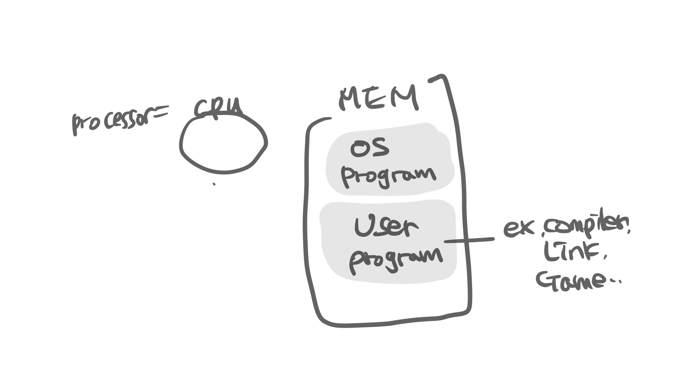
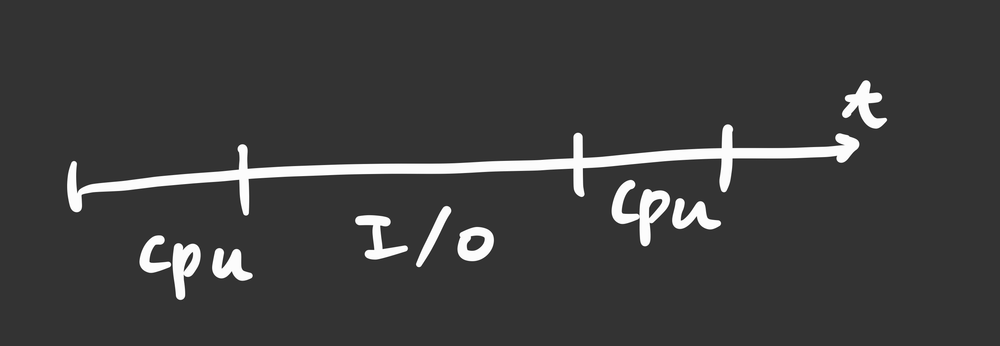
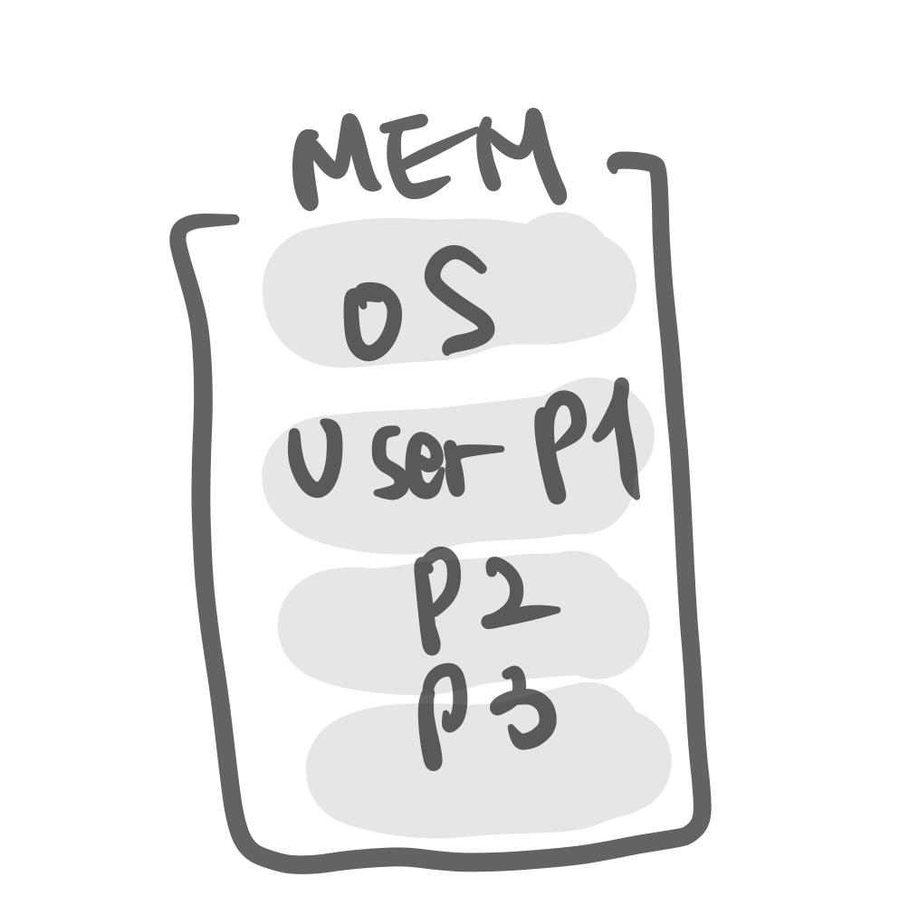
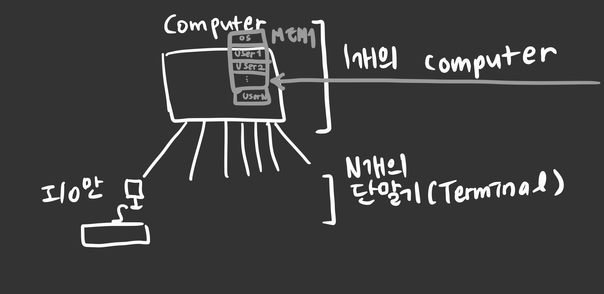
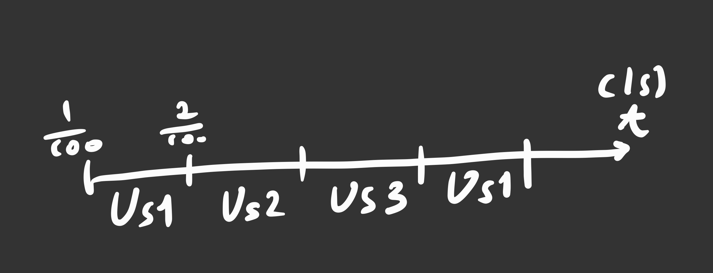
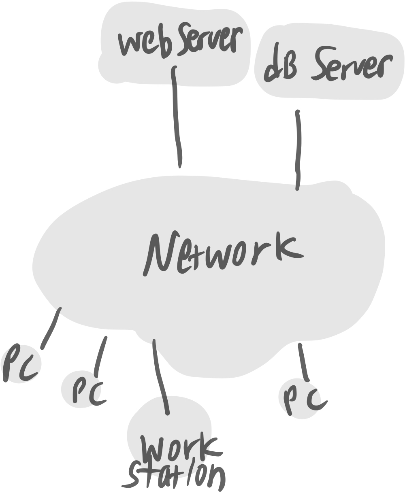

# 2, 3 운영체제 서론

## contents

-   [운영체제의 서론](#운영체제의-서론)
-   [운영체제의 역사](#운영체제의-역사)
-   [고등 운영체제, 인터럽트 기반 운영체제](#고등-운영체제-인터럽트-기반-운영체제)
-   [이중모드, 하드웨어 보호](#이중모드-하드웨어-보호)
-   [운영체제 서비스](#운영체제-서비스)

# 운영체제의 서론

운영체제가 없다면, 프로그램이 없을테니 메모리에는 쓰레기값만 가득할 것이다.

## 운영체제란?

운영체제는 User와 H/W간의 인터페이스로서 동작하는 시스템 소프트웨어의 일종으로,
OS는 file, 즉 HDD에 저장되어있는 instruction들의 집합체인 program을 RAM(메인메모리)로 올리는 역할을 하는 여러 프로그램의 모임이다.
그래서 OS가 없다면 저 프로그램(실행파일로 구성됨)을 실행 할 수 없다.

## 운영체제의 목적

가장 큰 목적은 컴퓨터 하드웨어(프로세서, mem, disk, network...)들을 잘 관리하여 성능향상을 하는 것에 있다. 또한 운영체제가 존재하기 떄문에 사용자가 마음대로 H/W를 관리하고, 편리하게 사용할 수 있다.

1. 성능 향상
2. User에게 편의성 제공
3. H/W를 관리하는 프로그램(control program for computer)

## 부팅(Booting)

컴퓨터의 구조를 보자. HDD에 OS와 IE, word 등의 다양한 프로그램 파일들이 저장되어있고, RAM(mainMEM)에는 프로세서로 가져갈 프로그램들(instruction들의 집합), ROM에는 부팅하는데에 필요한 명령들이 저장되어있다.


부팅하는 순간을 예로 들어보자.

1. power ON -> ROM에 접근해 `POST(Power-On Self-Test)` instruction이 부트로더를 실행시킨다.
2. **Booting** : `Boot loader`가 실행되고, HDD를 뒤져 ~~여기까지가 ROM의 역할~~
3. OS가 저장된 위치를 찾아 OS를 메인메모리로 가져온다.
4. 이제 OS는 power OFF 가 될 떄 까지 항상 RAM에 적재(resident)되어있는 상태로
5. 하드디스크에서 사용자가 프로그램 실행을 요청하면 해당 프로그램을 불러와 실행시키고, HW와 USER를 매개해주는 인터페이스의 역할을한다.

우리가 흔히 컴퓨터를 부탕한다고 말 하는 것은, 위의 2번의 과정을 말한다.

그래서 ROM은 최초 power ON시까지만 필요하고, 그 이후는 모두 OS가 제어하다 power OFF시에 메인메모리에서 OS가 사라진다.

## OS = kernel + shell(=command interpreter)

OS = 커널과 명령해석기의 역할을 한다. 현재까지의 컴퓨터 구조를 표현한 것과는 조금 다르게 그림을 그려보면, 이렇게 표현이 가능하다.


그래서 OS는 kernal(실제로 cpu, mem등의 hw를 관리하는 부분) + shell(User의 명령 해석(interpreter) -> 실행(execution)해 보여주기) 의 역할을 한다고 볼 수 있다.

-   OS에서 HW를 관리하는 부분: `kernal`
-   OS에서 Application 매개 : `shell == command interpreter`
    -   Text 명령 방식 : ex. Linux $ls, $who ...
    -   Graphic 명령 방식 : ex. Windows ...

그래서 OS에서는 kernal쪽을 위주로 배우게 되고, 각각 OS의 프로세서관리, MEM관리, network관리... 등으로 담당 관리 부분에 대해 심층적으로 배우게된다.

# 운영체제의 역사

## 1. No OS

이전에는 현재의 프로그래밍 환경과 달리 모든 작업을 한꺼번에 처리해야하고, 프로그램 실행 중간에 사용자가 데이터를 입력, 수정이 불가능한 **일괄 작업(처리) 시스템(batch job system)**이었다.

다시말해, operator라는 직업이 직접 물리세계에서 카드리더기를 만들어 -> 천공카드리더가 프로그램 및 데이터 입력 -> 메모리의 User영역에서 compile하여 -> 라인컴퓨터로 출력 하는 시스템이었다는 뜻이다.

☹️ 그래서 너무 번거롭다. 이 compile, link, load과정을 일괄적으로 처리시키자! 하여 고안한 것이 최초의 OS,

## 2. Batch processing system(일괄처리시스템)

이다. 이는 항상 메모리에 resident (상주)하고있다고 하여 **resident monitor**이라고도 한다.



이렇게 메모리에 OS program, User program이 들어갈 수 있는 공간들을 하나씩 두는 드디어 OS의 초기 모습이 나타난다. 그리고 하드웨어의 출시에 따라, 이제는 cpu외에도 I/O 장치들이 등장했다. 하지만 이것이 문제가 된다.

☹️
간단한 계산의 경우를 예를 들어보면, cpu와 HDD에 접근을 반복하며 처리를 수백만 번 하다보면 cpu -> I/O(||HDD 등의 hw) -> cpu -> I/O(||HDD 등의 hw) ... 의 무수한 반복이 진행된다. ~~이부분에서는 하드웨어중에서, for문 돈 후 출력을 표현하기 위해 I/O로 표현하였다~~



하지만 메모리에 User program이 사용할 수 있는 공간은 한개이기 때문에, I/O가 메모리를 사용하는 동안(일처리하는중..)은 **cpu는 Idle상태(놀고있는 상태)** 가 된다. 기본적으로 I/O가 cpu보다 훨씬 느리므로 크게 성능이 낭비된다.

그래서! **User Program Section을 여러개로 나눠 할당** 하자. 며 나온 것이

## 3. Multi programming system



이다. 이 multi programming system의 등장으로 인해 처리해야 할 다양한 문제들이 발생하는데,

-   CPU scheduling  
     : 123, 213을 처리하는 순서가 다름 등의 문제 해결
-   Memory 관리  
     : User program의 위치를 어떻게 둘것인지
-   Exception
-   New Program의 위치
-   Protect(보호)  
     : p1, p2, p3의 영역을 서로 보호하며 다중처리가 이루어져야함

등의 문제가 존재한다. OS에서는 이것들을 처리하는 how? 에 대하여 배우게된다.



☹️ 멀티 프로그래밍 시스템 또한 한계가 존재하는데, 컴퓨터의 값은 너무나 비쌌고 모니터나 키보드 등의 I/O장치가 등장함에 따라 하나의 컴퓨터를 n개의 단말기(terminal == I/O만 있는 형태)가 공유하여 사용했다. 그래서 User1이 처리를 하고있다면, User2, 3, ...n 은 기다려야만 했다.

그래서, **컴퓨터 한대를 여러명이 동시처럼 사용할 수 있는 방법은 없을까?** 하여 고안한 것이 바로

## 4. TSS(Time Sharing System) 이다.



이는 말 그대로 시간을 공유하여 사용하는 방식으로, 1/100초를 순서대로 user1, user2, ...userN명이 사용할 수 있도록 나눈 것이다. 그래서 user1의 프로세스가 끝나지 않았음에도 불구하고 바로 2로, ,, 이렇게 매우 짧은 시간 1/100초동안 일처리를 하다보면 거의 동시에 일을 하는 것처럼 보인다. 그래서 **대화형 system**이 가능해졌다고도 한다.

이후 user1, user2,, 을 순서대로 놓지 않고, 더 빨리 일처리를 할 수 있는 user의 업무를 먼저 해내자! 하는 **synchronize(동기)**에 대해 배우게된다.

☹️ 하지만 이 n이 너무 커지게 되면, 메모리가 부족하게 되는데, 그에대한 solution으로 HDD를 메모리처럼 사용하는 VM(Virtual Memory)의 개념이 등장하게되었다.

## 그래서 정리해보면,

1. No OS : operator직업이 존재 -> card reader -> compile > ...
2. Batch processing system(일괄처리) : (RAM) resident monitor  
   --- HDD출시! ---
3. Multiprogramming system(다중 프로그래밍)  
   --- 모니터, 키보드(I/O) 출시! (interactive. 대화가 가능해짐)---
4. TSS(Time-Sharing system, 시공유 시스템) : VM, Process간 통신, Synchronization(user1, us2, ... 동기화)

이 네트워크 기반 생태계 이전의 OS 의 역사에 대한 이야기이다.

## 5. 분산 시스템

70년대 후반, 매킨토시, MS-DOS를 비롯한 운영체제와 인터넷(TCP/IP, LAN)등이 보급되면서 컴퓨터를 개인용으로 보급이 가능했다. 그래서 복잡하거나 많은 양의 데이터를 처리하기위한 **메인프레임**이라는 대형 컴퓨터의 성능에 맞먹기위해 값이 싸고 작은 개인용 컴퓨터를 하나로 묶어 작업을 처리했는데, 이 시스템을 **분산 시스템(distributed system)** 이라고 한다.

## 6. client-server system

분산시스템은 시스템에 참여하는 모든 컴퓨터가 같은 지위를 갖기 때문에 고장이나 추가시 작업 분배가 번거로웠다. 그래서 request-response의 개념을 도입하기위해 고안한 시스템이 client-server 시스템이다.

이 구조는 특히나 web system 이 보급되면서 크게 와닿는 시스템구조로, 네트워크를 타고 TCP/IP 프로토콜에 기반하여 web의경우 http.. 등의 통신을 한다.

이 다발적인 req를 처리하는 작업을 **데몬(daemon)** 이 담당하는데, 이 데몬을 가진 컴퓨터를 서버라고 부른다. 데몬의 종류별로 web / FTP / e-mail... 등 용도에 따라 다른 서버가 된다.

## 7. P2P 시스템

네트워크의 발전으로 인해 파일의 크기가 커도 전송이 가능해졌다. 그에 따라 많은 미디어파일(MB s)들은 웹페이지(KB s)보다 용량이 매우 크기 때문에 서버의 부하를 줄일 수 있는 새로운 시스템으로 Peer-to-Peer system을 고안했다.

이는 흔히 알고있는 토렌트와같은 시스템으로, 사용자간 파일전송이 이루어지고 서버는 파일소유자의 검색/사용자 인증 등을 담당하여 서버의 부하가 적다는 것이 큰 장점이다.

## 기타 컴퓨팅 환경

1. **그리드 컴퓨팅(grid computing)**  
   : 하드웨어적인 컴퓨팅 환경의 통합이다. 바로 예를 들어보면, user1이 웹하드에서 파일을 내려받으려고 하면 서버에서 파일을 주는것이 아니라, 해당 파일을 과거에 다운받았던 user2의 컴퓨터에서 데이터를 몰래 빼와 전달한다. 그래서 일부 웹하드 서비스 업체에서는 무료로 이용권을 나누어주면서, 사용자들의 hw를 사용하며 몰래 delivery하곤한다.

2. **클라우드 컴퓨팅**  
   : 하드웨어를 포함한 시스템이 사용자에게 cloud에 가려 사용자에게 보이지 않도록 하는 컴퓨팅환경이라는 뜻으로, 서버관리와 네트워크 관리를 클라우드 서버 제공자가 알아서 해주기 때문에 굉장히 편리하다.

    - **SaaS(Sofrware as a Service)**
      : 사용자가 소프트웨어 기능을 이용한만큼 비용을 지불하는 것이다. 예를들어 google drive, Web Office 365 등의 클라우드 파일 스토리지를 말한다.
    - **IaaS(Infrastructure as a Service)**  
       : 서드파티 업체가 제공하는 자동화되고, 확장 가능한 it인프라를 말한다. 이 인프라에는 스토리지, 호스팅, 컴퓨팅, 네트워킹 등이 포함되며 비용은 사용한 만큼 지급한다. 가장 유명한 것이 aws의 cloud platform 서비스이다.
    - **PaaS(Platform as a Service)**  
       : 기본 IaaS는 물론 개발툴, 기능, 애플리케이션 배포 등을 안전하게 제공하는 것이다. 미들웨어, db관리, 애널리틱스, 운영체제 등이 포함된다. PaaS를 사용하면 개발자는 기반 인프라스트럭처를 프로비저닝(provisioning, 사용자의 요구에 맞게 시스템자원을 할당, 배치, 배포해두었다가 필요시 바로 사용할수있도록 준비해두는 것).
      예를 들어 google App Engine, Oracle Cloud Platform, Heroku 등이 있다.

3. **사물인터넷(IoT)**

## 컴퓨터의 규모별 분류

1980년대 이전에는, 사용자수 N이 얼마나 큰지에 따라 supercomputer > mainframe(000) > mini(00) > micro 로 나누게 되었다.

그러나 그 이후 네트워크를 기반으로 하면서 얼마나 많은 PC가 필요한지에 따라 규모를 구분하게 되었다.


supercomputer > server > workstation > PC > handheld(smartphone, notebook) > embeded

으로 구분하곤 한다.

# 고등 운영체제, 인터럽트 기반 운영체제

## 고등 운영체제

하나의 작업을 처리하기 위해서, cpu를 여러개를 두어 처리를 한다. 하지만 그 cpu/mem의 구조에 따라 시스템/OS 가 다르다. 여기서 핵심은, 메모리에 여러개의 프로세서를 적재시켜 작업을 처리하는데 cpu, mem의 구조가 어떻게 되느냐에 따라 시스템의 종류를 나눈다.

1.  다중 프로세서 시스템 (Multiprocessor) : cpu N개, mem 1개

    -   병렬 시스템(parallel) : cpu N개가 병렬
    -   이때 MEM 1개를 cpu N개가 공유하므로 tightly-coupled system이라고도 함
    -   이때의 OS를 multiprocessor OS 라고 함
    -   장점

        -   performance(cpu계산하는데 여러개 있으면 한번에 더 많은 계산가능)
        -   cost : 컴퓨터를 여러대 두는거보다 하나에 프로세서(cpu) 여러개 두는게 더 경제적 ~~고성능하나보다 저성능여러개가더경제적~~
        -   reliability : cpu 하나가 고장나더라도 다른 cpu가 동작할수있어서 신뢰도 ㄱㅊ

2.  분산 시스템 (Distributed)

    -   multi-computer : LAN으로 연결된 (cpu - MEM)\*N개 의 컴퓨터
    -   이때의 각각의 (cpu - MEM)\*N 개가 LAN으로 연결되어있으므로 loosely-coupled system이라고도 함
    -   각각의 (cpu - MEM)은 하나의 일을 나누어서 처리하는 것이므로, 서로간 통신이 가능해야함. 이떄의 OS를 distributed OS 라고 함

3.  실시간 시스템 (Real-time)  
    이는 위 2가지와 목적이 살짝 다르다
    리얼타임 : 어떤 프로그램이 정해진 시간 내에 작업이 끝나야 하는 시스템
    -   시간제약이 주어진 시스템
    -   FA(공장 자동화), 군사, 항공, 우주 등에 사용됨
    -   real-time OS(RTOS) 라고 함

## 인터럽트 기반 시스템

현대의 OS는 인터럽트 기반 시스템이다. 그 순서대로 한번 보자. ~~[20m](http://www.kocw.net/home/search/kemView.do?kemId=978503)~~

1. 부팅
2. 부팅이 끝나면, OS는 MEM에 resident 하며 event를 기다리면서 대기중...
3. event 발생 : ex. 마우스-아이콘 더블클릭
4. H/W 인터럽트(전기신호) 실행
5. 인터럽트 결과 OS내에서 ISR(Interrupt Service Routine)실행 ex. 마우스 인터럽트 서비스 루틴(ex. hwp를 눌렀을경우 OS 내 HDD읽어오는 코드가 hwp HDD에서 찾아옴)
6. ISR(Interrupt Service Routine)종료 후 다시 대기 (하면서 RAM 으로 프로그램 올림)

H/W인터럽트 외에 S/W 인터럽트도 존재한다. 사실상, 인터럽트의 개념은 과거 CPU가 모든 입출력에 관여하면 (polling. 폴링 방식 사용할 경우) 작업효율이 현저하게 떨어진다는 문제를 해결하기 위해 처음 고안되었다.

add, lw ... 들이 있지만 int(인터럽트! OS 중지시켜라)하는 명령어도 존재했음. 이 int 명령어같이 외부적으로 멈추게 하는 전기신호가 오지는 않지만, SW로 멈추는 처리를 해둔 것을 S/W 인터럽트라고 말한다.

이 또한 ISR종료 후 다시 User Program으로 돌아간다.

## 인터럽트 기반 운영체제란?

평소에는 OS가 대기상태로 있다가

-   HW인터럽트에 의해 ISR(OS내 Interrupt ServiceRoutine) 코드가 실행
-   SW인터럽트에 의해 ISR 코드 실행
-   내부인터럽트에 의해 ISR실행  
     ex. 5/0 = infinite.. 이 값을 저장할 수 없다. 그래서 이 때 실행이 불가능함. 이러한 사건이 일어나면 내부적으로 인터럽트가 일어났다고 판단하여 OS내에있는 `divide by 0` 코드를 실행시켜 -> 프로그램 종료(등의 exception 처리)시킨다.

ISR가 종료되면 원래의 대기상태 또는 User Program으로 복귀한다.

이처럼 우리가 사용하는 OS는 모두 인터럽트 기반 운영체제이다. User Program과 OS 내의 코드(ISR)가 반복 번갈아가며 memory에서 실행된다.

# 이중모드, 하드웨어 보호

## 듀얼모드

한 컴퓨터를 여러사람이 동시에 사용하는 환경이거나 (ex. 서버컴퓨터) 한 사람이 여러개의 프로그램을 동시에 사용하는 환경일 때 (ex. 스마트폰, PC) 일반 사용자가 STOP명령등을 실행시켜 cpu를 중단시키는 일이 발생하면 안된다. 그래서 사용자 프로그램은 치명적인 명령을 사용할 수 없게 모드를 나눈 것이다.

1. User 모드 (사용자 모드)
2. Supervisor 모드(관리자 모드, monitor, priviliged, system 모드) = OS

privileged instruction 중에는 STOP, HALT, RESET, SET_TIMER, SET_HW .. 등이 대표적이다.

dual mode 의 시나리오를 보자.

-   register에 모드를 나타내는 (이중모드를 나타내는) flag(상태 bit) 하나를 더 추가한다. ex. monitor bit 라고 했을 경우 1->systemMode, 0->userMode 이런 식으로 듀얼모드를 나타낸다.
-   power ON
-   BOOT : OS가 HDD -> RAM으로 적재 && `monitorbit==1(systemMode)`
-   OS BOOOTING 끝, 사용자 프로그램 실행시키려고 더블클릭 -> `monitorbit==0(userMode)`
-   프로그램이 RAM으로 적재, 이후 HW/SW 인터럽트 발생 시 처리 -> `monitorbit==1(systemMode)`
-   OS 서비스가 끝남 -> `monitorbit==0(userMode)`

일반 유저프로그램이 하드디스크에 접근할 수 있다는 뜻은 서버컴퓨터에 여러 사용자 / 여러 프로그램 파일이 있는데, 상관이 없는 프로그램/사용자가 하드디스크에 접근할 수 있으므로 보안에 취약하다는 문제가 있다.

**그래서 일반 유저 프로그램이 데이터의 업데이트 및 저장을 할 때는, SW인터럽트를 사용하여 -> cpu는 현재 하는 일을 중단하고 OS 내에 있는 ISR(Interrupt Service Routine)로 이동 -> 현재 업데이트 할 데이터를 하드디스크에 접근하여 저장**

대부분의 cpu는 monitorBit가 있다! 이 2중모드는 보호와 관련이 깊다.

## 하드웨어 보호

과거 하나의 컴퓨터를 여러명의 사용자가 공유한다는 것은, ~~현재의 서버컴퓨터의 개념과도 마찬가지~~ 다른 사용자가 다른 사용자의 정보에 접근하거나 내용을 변경시키면 안된다는 뜻이다. 그래서 OS가 다양한 보호 처리를(입출력장치, 메모리, cpu) 해주어야한다.

-   **I/O device protection**
    -   타 사용자의 정보 수정/삭제하거나 HDD 접근하려함ㅜㅜ
    -   🧚🏻‍♀️ 입출력을 하려면 OS에게 요청 `systemMode 전환`-> OS가 IN/OUT 하며 업무를 마친 후 다시 `userMode 복귀` -> 올바른 요청이 아닐 경우 OS가 거부
    -   `Privileged instruction violation` : userMode에서는 priviliged명령들을 사용할 수 없게 -> 제한
-   **Memory protection**
    -   OS해킹할수도있음 ㅠㅠ 핵 치명적!
    -   🧚🏻‍♀️`MMU(Memory Management Unit)`를 두어 다른 메모리영역 침범을 감시하도록 함. MEM번지를 다들 할당해주어, 문지기역할을 하는 MMU가 해당 번지만을 읽을 수 있도록 한다. (이 MMU안에있는 baseLimit 할당은 OS가 함)
    -   `Segment violation` : 다른 사용자/OS영역의 메모리에 접근을 시도했을 경우 -> 제한
-   **CPU protection**
    -   한 사용자가 실수, 고의로 CPU 시간을 독점할 경우ㅜ ex. while(1) 을 사용자 A가 코드로 하여, 작업이 끝나지 않아 사용자 B의 작업을 처리하지 못하는 경우
    -   🧚🏻‍♀️ `timer`을 두어 일정시간 경과 시 timer interrupt(인터럽트 -> OS -> 다른 프로그램으로 강제 전환을 막음)

# 운영체제 서비스

모든 프로그램은 자원(cpu, mem ...)을 사용하는데, 그 자원을 효율적으로 사용하게 control 해주는 것이 OS. OS에는 해당 업무에 따라 작업 담당이 구분되어있다.

-   process management(프로세스관리) : cpu 자원을 나누어줌
-   mainMemory management(주기억장치관리) : main memory(RAM)를 application에게 나누어줌
-   file management(파일관리) : HDD 내에 있는 file들을 관리해줌
-   Secondary storage management (보조기억장치 관리)
-   I/O management(입출력장치관리)
-   networking management(네트워킹 관리)
-   protection(보호)

등이 있다. 그 중에 OS에서는 process management, mainmemory management을 집중적으로 배운다.

1. Process management (프로세스 관리)
    - Process : 메인 메모리 내에서 실행중인 프로그램(program in execution). != program management
    - 기능
        - 프로세스의 생성, 소멸 (creation, deletion)
        - 프로세스 활동 일시 중지, 재개 (suspend, resume)
        - 프로세스 간 통신 (interprocess communication : IPC)
        - 프로세스 간 동기화 (synchronization)
        - 교착상태 처리 (deadlock handling)
2. mainMemory management (메모리 관리)
    - 기능
        - 프로세스에게 메모리 공간 할당 (allocation)
        - 메모리의 어느 부분이 어느 프로세스에게 할당되었는가 추적, 감시
        - 프로세스 종료 시 메모리 회수 (deallocation)
        - 메모리의 효율적인 사용
        - VM : 실제 메모리의 물리 크기 보다 더 큰 용량을 갖도록 함
3. File management (파일 관리)

    - 물리적으로 track, sector로 구성되어있는 것을 사용자들에게 file 이라는 개념으로 사용할 수 있도록 해줌.
    - 기능
        - 파일 생성, 삭제 (file creation, deletion)
        - directory 생성, 삭제(folder)
        - open, close, CRUD
        - track, sector : file간의 mapping
        - backup

4. Secondary storage management (보조기억장치 관리)
    - 하드디스크, 플래시 메모리 등을 관리
    - 기능
        - 빈 공간 관리 (free space management)
        - 저장 공간 할당 (storage allocation)
        - 디스크 스케쥴링 (disk scheduling) : 얼마나 최소한으로 움직여서, 어떤 경로로 디스크 해당 파일에 접근할수있을지 계산
5. I/O management (입출력 장치 관리)
    - 기능
        - 장치 드라이브 (Device drivers) : 어떠한 장치를 사용하기 위한 디바이스 드라이브 설치하는데, OS 에 설치해서 사용할 수 있게끔 하는 것
        - 입출력 장치의 성능 향상
            - buffering : 입출력 장치에서 읽은 내용을 메모리로 들고옴. 한번 메모리로 들고오면 그다음부터는 빨리 읽을 수 있을테니!
            - caching : buffering과 비슷
            - spooling : 메모리 대신 하드디스크를 중간 매체로 사용하는것. ex. print 사용할 떄 프린트보다는 빠르고 cpu보다는 느린 disk 에 처리한 값을 저장하고, print로 보내 오버헤드를 조금 줄이는 것.

## System calls

일반 application 프로그램이 운영체제 서비스(ex. 메모리 관리기능, processor 관리기능 ...) 를 받기 위해 호출하는 것. 쉽게말해 user Program이 OS에게 나좀 일하게 도와줘.. 하고 요청하는 것이다.

주요 시스템 콜

-   Process : end(정상종료), abort(강제종료), load(HDD->RAM으로가져옴), execute, create, terminate(==end), get/set attributes(process의 속성(메모리 얼마나 사용하고있음, id 등...)), wait event, signal event
-   Memory : allocate(명시적 || ex. new 로 객체 생성시 OS에 요청), free(다 쓰면 반납)
-   File : CRUD, open, close, ,,,
-   Device" request, release, attach/detache devices ...
-   Information : get/set time, get/set system data
-   Communication : socket, send, receive

그럼 이 system call이 어떻게 이루어지는지 한번 예제로 보자.

### [MS-DOS](http://spike.scu.edu.au/~barry/interrupts.html)

`Create file`하려면 `3C`function code로 한다.

```
[Index]AH = 3Ch - "CREAT" - CREATE OR TRUNCATE FILE

Entry:

CX = file attributes # file attributes(이 파일의 경로, 날짜, 확장자 등)을 CX reg에 넣어라
DS:DX -> ASCIZ filename # DX reg가 file의 이름을 나타내게 해라.
Return:

CF clear if successful, AX = file handle
CF set on error AX = error code (03h,04h,05h)
Notes: if a file with the given name exists, it is truncated to zero length

SeeAlso: AH=16h,AH=3Dh,AH=5Ah,AH=5Bh
```

라고 써져있는데, Create file을 하려면 이러한 system call을 만들어라!! 라는 뜻이다. 실제로 만들어보자.

MS-DOS : INT 21H

```
mov cx, 0      # attributes : null 이라 침
mov dx, 100    # ds 는 보통 만들어져있기 떄문에 dx만 설정, 100번지
mov ah, 3c     # create file 의 func code
int 21         # sw interrupt. MS-DOS의 경우 21이 int code이다.
```

100번지에 "aaaa"라는 제목파일이 저장되어 있을 경우 위처럼 코드를 작성해주면 aaaa 라는 파일이 생성된다.

위 예제는 MS-DOS였으니 이제 리눅스를 한번 봐보자.

ex. create file
EAX = 8, ECX = file attributes, EBX = file name.

Linux : INT 80H

```
mov eax, 8
mov ecx, 0    # attributes : null 이라 침
mov ebx, ??   # ?? : file name 이 적혀있는 주소
int 80        # sw interrupt. Linux의 경우 80이 int code이다.
```

이렇게 system call을 하면 OS가 여러가지를 계산하여 적절한 위치/크기 등을 만든다.

그리고 `system call library` : system call을 처음부터 object 파일로 만들어서 우리에게 제공하는 것을 말한다.

예제를 정리를 해보면, `OS system call`은 **특정 레지스터에 특정 값을 넣고 -> sw interrupt 를 발생시켜 서비스를 받음**.
