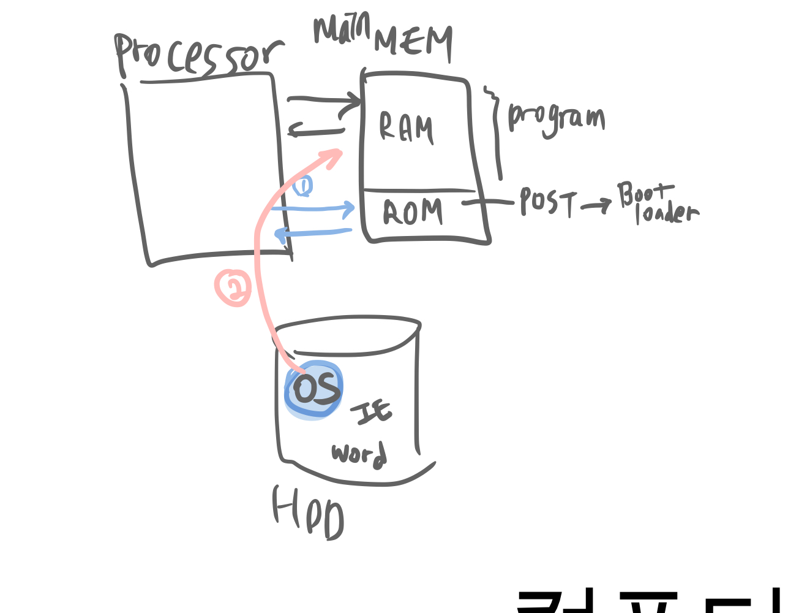
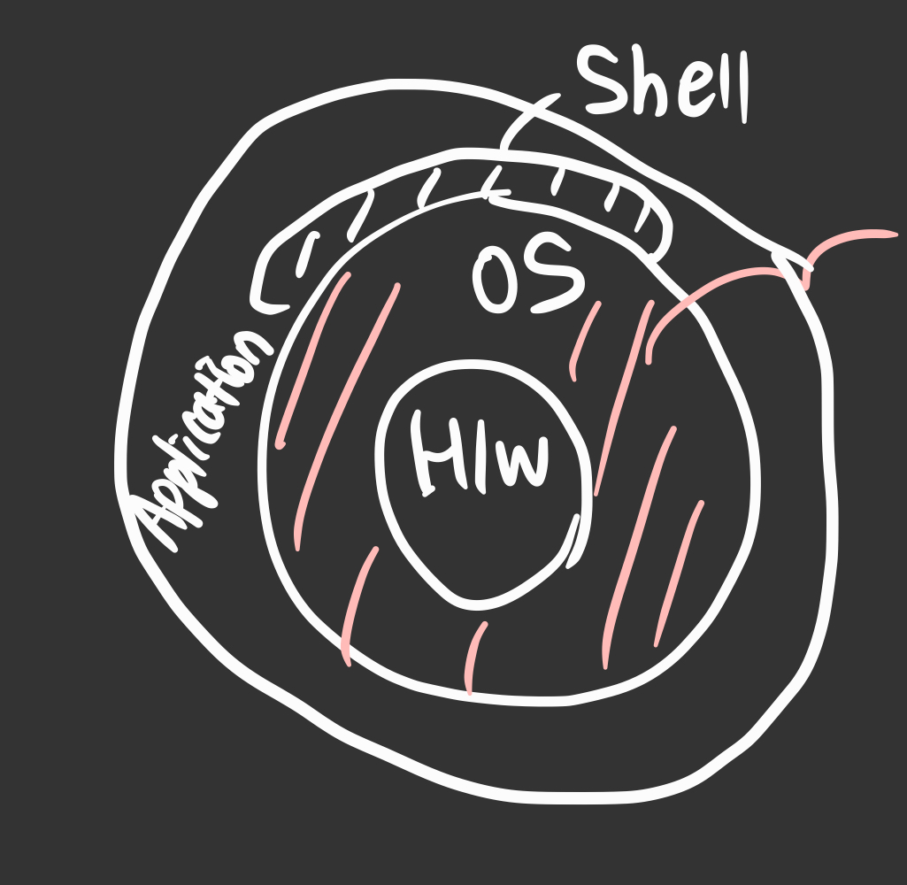

# 2

## contents

-   [운영체제의 서론](#운영체제의-서론)
-   [운영체제의 역사](#운영체제의-역사)
-   [고등 운영체제, 인터럽트 기반 운영체제](#고등-운영체제,-인터럽트-기반-운영체제)

# 운영체제의 서론

운영체제가 없다면, 프로그램이 없을테니 메모리에는 쓰레기값만 가득할 것이다.

## 운영체제란?

운영체제는 User와 H/W간의 인터페이스로서 동작하는 시스템 소프트웨어의 일종으로,
OS는 file, 즉 HDD에 저장되어있는 instruction들의 집합체인 program을 RAM(메인메모리)로 올리는 역할을 하는 여러 프로그램의 모임이다.
그래서 OS가 없다면 저 프로그램(실행파일로 구성됨)을 실행 할 수 없다.

## 운영체제의 목적

가장 큰 목적은 컴퓨터 하드웨어(프로세서, mem, disk, network...)들을 잘 관리하여 성능향상을 하는 것에 있다. 또한 운영체제가 존재하기 떄문에 사용자가 마음대로 H/W를 관리하고, 편리하게 사용할 수 있다.

1. 성능 향상
2. User에게 편의성 제공
3. H/W를 관리하는 프로그램(control program for computer)

## 부팅(Booting)

컴퓨터의 구조를 보자. HDD에 OS와 IE, word 등의 다양한 프로그램 파일들이 저장되어있고, RAM(mainMEM)에는 프로세서로 가져갈 프로그램들(instruction들의 집합), ROM에는 부팅하는데에 필요한 명령들이 저장되어있다.

부팅하는 순간을 예로 들어보자.

1. power ON -> ROM에 접근해 `POST(Power-On Self-Test)` instruction이 부트로더를 실행시킨다.
2. **Booting** : `Boot loader`가 실행되고, HDD를 뒤져 ~~여기까지가 ROM의 역할~~
3. OS가 저장된 위치를 찾아 OS를 메인메모리로 가져온다.
4. 이제 OS는 power OFF 가 될 떄 까지 항상 RAM에 적재(resident)되어있는 상태로
5. 하드디스크에서 사용자가 프로그램 실행을 요청하면 해당 프로그램을 불러와 실행시키고, HW와 USER를 매개해주는 인터페이스의 역할을한다.

우리가 흔히 컴퓨터를 부탕한다고 말 하는 것은, 위의 2번의 과정을 말한다.

그래서 ROM은 최초 power ON시까지만 필요하고, 그 이후는 모두 OS가 제어하다 power OFF시에 메인메모리에서 OS가 사라진다.

## OS = kernel + shell(=command interpreter)

OS = 커널과 명령해석기의 역할을 한다. 현재까지의 컴퓨터 구조를 표현한 것과는 조금 다르게 그림을 그려보면, 이렇게 표현이 가능하다.

그래서 OS는 kernal(실제로 cpu, mem등의 hw를 관리하는 부분) + shell(User의 명령 해석(interpreter) -> 실행(execution)해 보여주기) 의 역할을 한다고 볼 수 있다.

-   OS에서 HW를 관리하는 부분: `kernal`
-   OS에서 Application 매개 : `shell == command interpreter`
    -   Text 명령 방식 : ex. Linux $ls, $who ...
    -   Graphic 명령 방식 : ex. Windows ...

그래서 OS에서는 kernal쪽을 위주로 배우게 되고, 각각 OS의 프로세서관리, MEM관리, network관리... 등으로 담당 관리 부분에 대해 심층적으로 배우게된다.

# 운영체제의 역사

## 그래서 정리해보면

1. No OS : operator직업이 존재 -> card reader -> compile > ...
2. Batch processing system(일괄처리) : (RAM) resident monitor
   (HDD 출시!!)
3.

---

# 고등 운영체제, 인터럽트 기반 운영체제
