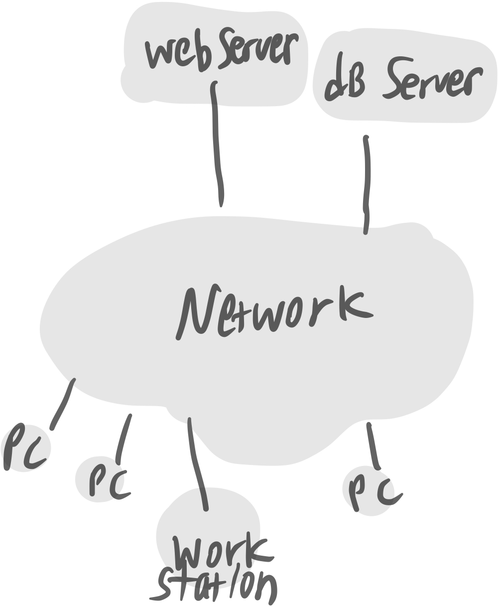

# 2

## contents

-   [운영체제의 서론](#운영체제의-서론)
-   [운영체제의 역사](#운영체제의-역사)
-   [고등 운영체제, 인터럽트 기반 운영체제](#고등-운영체제,-인터럽트-기반-운영체제)

# 운영체제의 서론

운영체제가 없다면, 프로그램이 없을테니 메모리에는 쓰레기값만 가득할 것이다.

## 운영체제란?

운영체제는 User와 H/W간의 인터페이스로서 동작하는 시스템 소프트웨어의 일종으로,
OS는 file, 즉 HDD에 저장되어있는 instruction들의 집합체인 program을 RAM(메인메모리)로 올리는 역할을 하는 여러 프로그램의 모임이다.
그래서 OS가 없다면 저 프로그램(실행파일로 구성됨)을 실행 할 수 없다.

## 운영체제의 목적

가장 큰 목적은 컴퓨터 하드웨어(프로세서, mem, disk, network...)들을 잘 관리하여 성능향상을 하는 것에 있다. 또한 운영체제가 존재하기 떄문에 사용자가 마음대로 H/W를 관리하고, 편리하게 사용할 수 있다.

1. 성능 향상
2. User에게 편의성 제공
3. H/W를 관리하는 프로그램(control program for computer)

## 부팅(Booting)

컴퓨터의 구조를 보자. HDD에 OS와 IE, word 등의 다양한 프로그램 파일들이 저장되어있고, RAM(mainMEM)에는 프로세서로 가져갈 프로그램들(instruction들의 집합), ROM에는 부팅하는데에 필요한 명령들이 저장되어있다.

부팅하는 순간을 예로 들어보자.

1. power ON -> ROM에 접근해 `POST(Power-On Self-Test)` instruction이 부트로더를 실행시킨다.
2. **Booting** : `Boot loader`가 실행되고, HDD를 뒤져 ~~여기까지가 ROM의 역할~~
3. OS가 저장된 위치를 찾아 OS를 메인메모리로 가져온다.
4. 이제 OS는 power OFF 가 될 떄 까지 항상 RAM에 적재(resident)되어있는 상태로
5. 하드디스크에서 사용자가 프로그램 실행을 요청하면 해당 프로그램을 불러와 실행시키고, HW와 USER를 매개해주는 인터페이스의 역할을한다.

우리가 흔히 컴퓨터를 부탕한다고 말 하는 것은, 위의 2번의 과정을 말한다.

그래서 ROM은 최초 power ON시까지만 필요하고, 그 이후는 모두 OS가 제어하다 power OFF시에 메인메모리에서 OS가 사라진다.

## OS = kernel + shell(=command interpreter)

OS = 커널과 명령해석기의 역할을 한다. 현재까지의 컴퓨터 구조를 표현한 것과는 조금 다르게 그림을 그려보면, 이렇게 표현이 가능하다.

그래서 OS는 kernal(실제로 cpu, mem등의 hw를 관리하는 부분) + shell(User의 명령 해석(interpreter) -> 실행(execution)해 보여주기) 의 역할을 한다고 볼 수 있다.

-   OS에서 HW를 관리하는 부분: `kernal`
-   OS에서 Application 매개 : `shell == command interpreter`
    -   Text 명령 방식 : ex. Linux $ls, $who ...
    -   Graphic 명령 방식 : ex. Windows ...

그래서 OS에서는 kernal쪽을 위주로 배우게 되고, 각각 OS의 프로세서관리, MEM관리, network관리... 등으로 담당 관리 부분에 대해 심층적으로 배우게된다.

# 운영체제의 역사

## 1. No OS

이전에는 operator가 직접 물리세계에서 카드리더기를 만들어 -> compile하여 processing을 담당했다. 하지만 이방식은 총체적 난국이다. 컴퓨터가 비쌌기 떄문에, 가능한 일이었던것^^.. operator가 하는 일은 compile -> link -> load하여 처리했는데, operator을 담당하는 사람이 없다면 compile 자체가 불가능 한 것 ㅠㅠ

☹️ 그래서 너무 번거롭다. 이 compile, link, load과정을 일괄적으로 처리시키자! 하여 고안한 것이 최초의 OS,

## 2. Batch processing system(일괄처리시스템)

이다. 이는 항상 메모리에 resident (상주)하고있다고 하여 **resident monitor**이라고도 한다.

이렇게 메모리에 OS program, User program이 들어갈 수 있는 공간들을 하나씩 두는 드디어 OS의 초기 모습이 나타난다. 그리고 하드웨어의 출시에 따라, 이제는 cpu외에도 I/O 장치들이 등장했다. 하지만 이것이 문제가 된다.

☹️
간단한 계산의 경우를 예를 들어보면, cpu와 HDD에 접근을 반복하며 처리를 수백만 번 하다보면 cpu -> I/O(||HDD 등의 hw) -> cpu -> I/O(||HDD 등의 hw) ... 의 무수한 반복이 진행된다. ~~이부분에서는 하드웨어중에서, for문 돈 후 출력을 표현하기 위해 I/O로 표현하였다~~

하지만 메모리에 User program이 사용할 수 있는 공간은 한개이기 때문에, I/O가 메모리를 사용하는 동안(일처리하는중..)은 **cpu는 Idle상태(놀고있는 상태)** 가 된다. 기본적으로 I/O가 cpu보다 훨씬 느리므로 크게 성능이 낭비된다.

그래서! **User Program Section을 여러개로 나눠 할당** 하자. 며 나온 것이

## 3. Multi programming system

이다. 이 multi programming system의 등장으로 인해 처리해야 할 다양한 문제들이 발생하는데,

-   CPU scheduling  
     : 123, 213을 처리하는 순서가 다름 등의 문제 해결
-   Memory 관리  
     : User program의 위치를 어떻게 둘것인지
-   Exception
-   New Program의 위치
-   Protect(보호)  
     : p1, p2, p3의 영역을 서로 보호하며 다중처리가 이루어져야함

등의 문제가 존재한다. OS에서는 이것들을 처리하는 how? 에 대하여 배우게된다.

☹️ 멀티 프로그래밍 시스템 또한 한계가 존재하는데, 컴퓨터의 값은 너무나 비쌌고 모니터나 키보드 등의 I/O장치가 등장함에 따라 하나의 컴퓨터를 n개의 단말기(terminal == I/O만 있는 형태)가 공유하여 사용했다. 그래서 User1이 처리를 하고있다면, User2, 3, ...n 은 기다려야만 했다.

그래서, **컴퓨터 한대를 여러명이 동시처럼 사용할 수 있는 방법은 없을까?** 하여 고안한 것이 바로

## 4. TSS(Time Sharing System) 이다.

이는 말 그대로 시간을 공유하여 사용하는 방식으로, 1/100초를 순서대로 user1, user2, ...userN명이 사용할 수 있도록 나눈 것이다. 그래서 user1의 프로세스가 끝나지 않았음에도 불구하고 바로 2로, ,, 이렇게 매우 짧은 시간 1/100초동안 일처리를 하다보면 거의 동시에 일을 하는 것처럼 보인다. 그래서 **대화형 system**이 가능해졌다고도 한다.

이후 user1, user2,, 을 순서대로 놓지 않고, 더 빨리 일처리를 할 수 있는 user의 업무를 먼저 해내자! 하는 **synchronize(동기)**에 대해 배우게된다.

☹️ 하지만 이 n이 너무 커지게 되면, 메모리가 부족하게 되는데, 그에대한 solution으로 HDD를 메모리처럼 사용하는 VM(Virtual Memory)의 개념이 등장하게되었다.

## 그래서 정리해보면,

1. No OS : operator직업이 존재 -> card reader -> compile > ...
2. Batch processing system(일괄처리) : (RAM) resident monitor  
   --- HDD출시! ---
3. Multiprogramming system(다중 프로그래밍)  
   --- 모니터, 키보드(I/O) 출시! (interactive. 대화가 가능해짐)---
4. TSS(Time-Sharing system, 시공유 시스템) : VM, Process간 통신, Synchronization(user1, us2, ... 동기화)

## 컴퓨터의 규모별 분류

1980년대 이전에는, 사용자수 N이 얼마나 큰지에 따라 supercomputer > mainframe(000) > mini(00) > micro 로 나누게 되었다.

그러나 그 이후 네트워크를 기반으로 하면서 얼마나 많은 PC가 필요한지에 따라 규모를 구분하게 되었다.

supercomputer > server > workstation > PC > handheld(smartphone, notebook) > embeded

으로 구분하곤 한다.

---

# 고등 운영체제, 인터럽트 기반 운영체제

s
