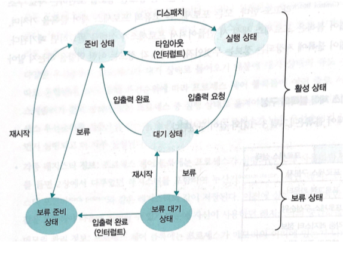
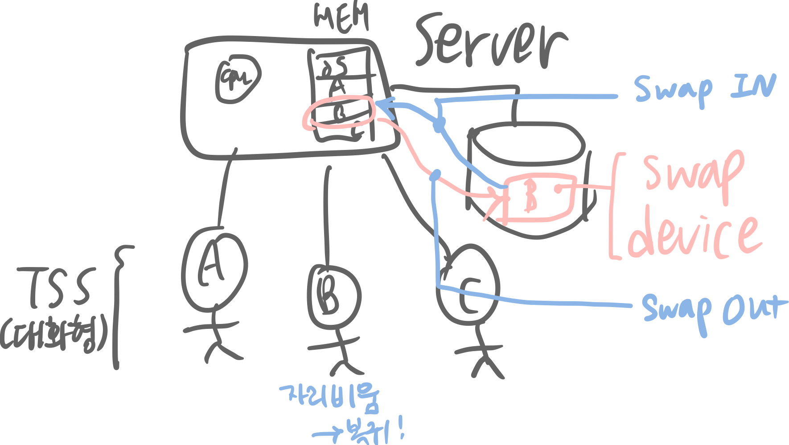
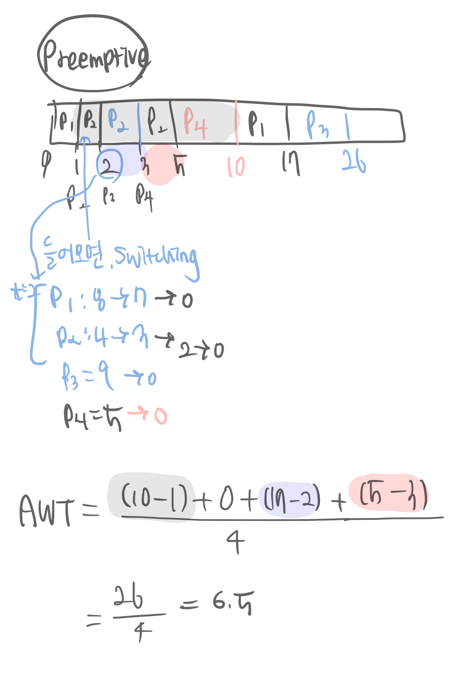
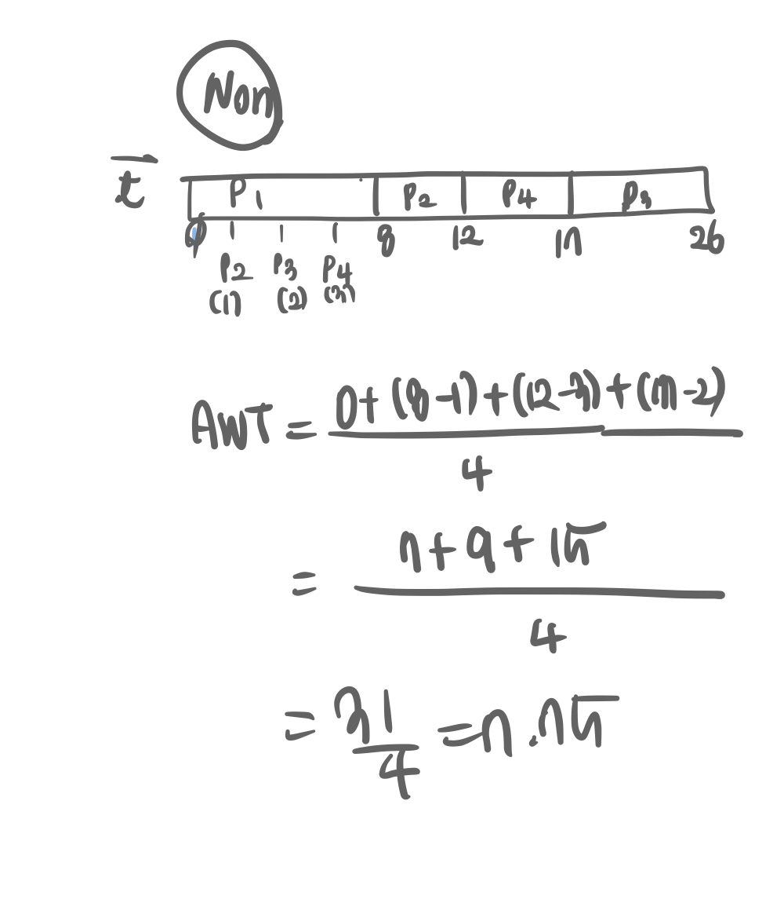
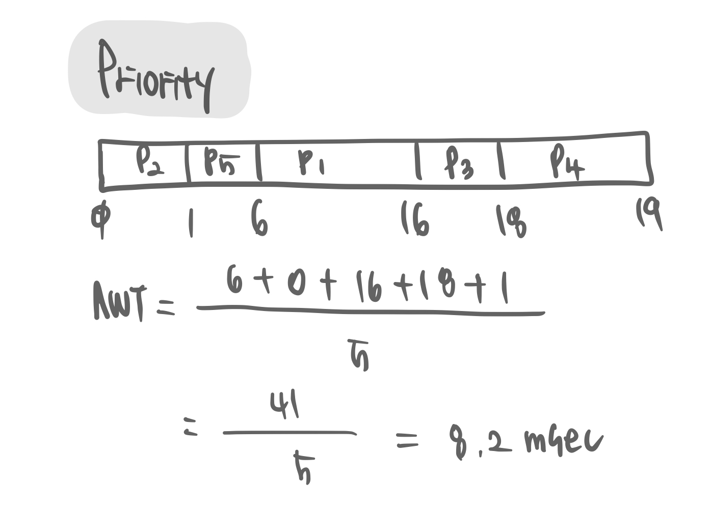
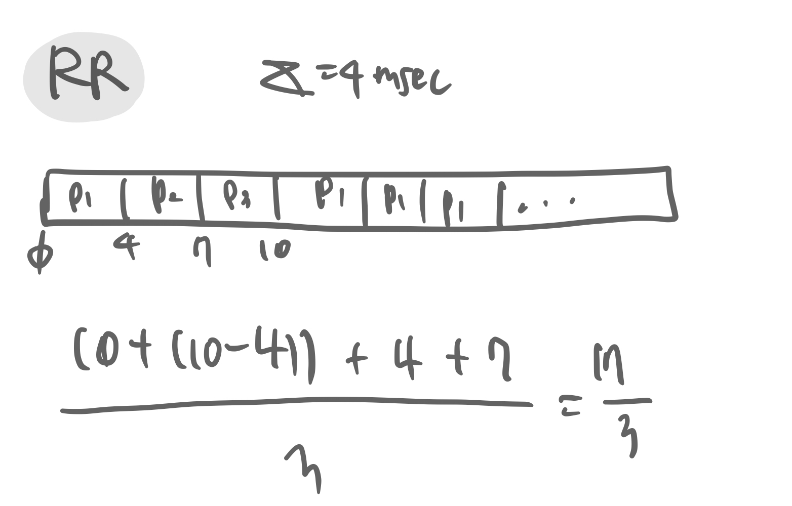
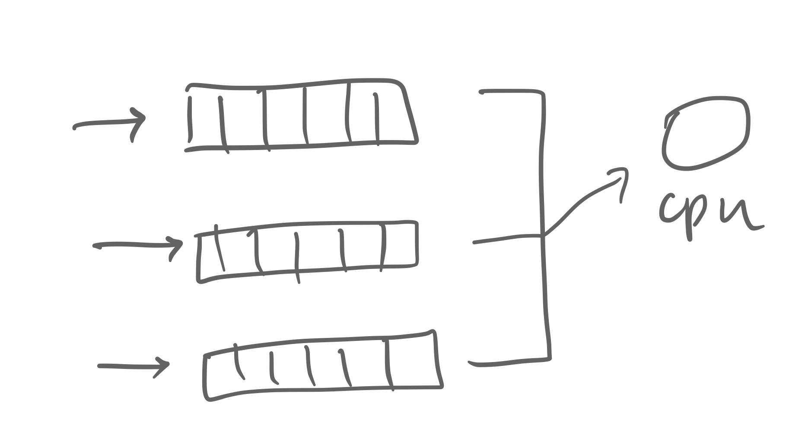

# 프로세스 관리, CPU 스케쥴링 알고리즘

## contents

-   [프로세스 관리](#프로세스-관리)
-   [CPU 스케쥴링 알고리즘](#CPU-스케쥴링-알고리즘)
-   [프로세스 생성, 종료](#프로세스-생성-종료)

# 프로세스 관리

프로세스 : cpu 자원을 효율적으로 나누어 주는 것.

## program vs process

-   program : HDD 안에있는, 아직 메인메모리로 call 되지 못한 데이터.
-   process : HDD 안에서 메인메모리로 적재되어 처리되는 데이터.

cpu는 program이 아니라 process 와 커뮤니케이션함. 정리하면 하드디스크 속 프로그램, 메인메모리에서 살아 움직이는 프로세스.

## 프로세스의 상태

-   new : 메인 메모리로 올라온 상태
    -   메모리 할당
    -   PCB 생성
-   ready : 초기화를 끝내고 실행할 준비가 모두 된 상태 Queue에서!
    -   dispatch(PID): 준비 -> 실행
-   running : 실제 cpu 가 실행중인 서비스
    -   timeout(PID): 실행 -> 준비
    -   exit(PID): 실행 -> 완료
    -   block(PID): 실행 -> 대기
-   waiting : 예를들면 프린트 등의 업무를 처리할 때, cpu는 다른 프로세스를 먼저 처리하고 프린트하는 애는 waiting 상태로 둠 (예를들면 프린트가 끝나면(waiting 끝), 다시 Ready 상태로 두어 cpu 실행을 기다림.) I/O를 만난상태 등이 있음.
    -   wakeup(PID): 대기 -> 준비
-   terminated : 해당 프로세스의 모든 작업이 끝난 상태
    -   메모리 정리(삭제)
    -   PCB 삭제

그리고 멀티프로세스시스템과는 다르게, 그림에서 running -> ready로 가는 부분 은 TSS(Time Sharing System)의 경우에 해당한다. TSS는 일정 시간이 지나면 강제로 switching 하기 때문! 그림에서는 `interrupt`라고 표현했지만, `time expired`의 의미의 interrupt이다.

이렇게 대부분의 프로세스는 생성, 준비, 실행, 대기, 완료 상태 (active status)로 운영되지만 특수한 경우가 존재한다.

1.  pause status(휴식 상태)

    -   프로세스가 일시적으로 쉬고있는 상태이다. 프로그램 실행중 `ctrl + z`를 눌렀을 경우, sleep~ 상태로 들어간것이다.

2.  suspend status(보류 상태)  
    일시 정지 상태. 일반적으로 아래와 같은 경우가 있다.

        

    -   메모리가 꽉 차서 일부 프로세스를 메모리 밖으로 내보낼 때
    -   프로그램에 오류가 있어서 실행을 미루어야 할 때
    -   바이러스와 같이 악의적인 공격을 하는 프로세스라고 판단될 때
    -   매우 긴 주기로 반복되는 프로세스라 메모리 밖으로 쫓아내도 큰 문제가 없을 때
    -   입출력을 기다리는 프로세스의 입출력이 계속 지연될 때

    정리해보자면, 대부분이 컴퓨터의 성능을 떨어뜨리는 경우나 || 실행을 미루어도 큰 지장이 없는 경우이 suspend status라고 표현한다.

    이렇게 suspend status로 들어간 process는 메모리 밖으로 쫓겨나 `swap area`에 보관된다.

## PCB(Process Control Block = TCB, Task Control Block)

process == task. 같은 의미로 사용한다. 이 PCB(TCB)안에는 프로세스에 대한 모든 정보가 들어가있다. 하나의 프로세스 당 1개의 PCB가 있다. 보통 PCB에 아래와 같은 정보들이 들어가기 때문에, struct(구조체)등으로 만들곤 한다.

### [PCB내에 들어가는 정보들]

-   `상태 정보` : 처음에 0A6 번지에서 시작했고, 현재는 0D3 번지까지 running 하다가 waiting 상태로 되었다! 등
-   `각종 중간값` : 프로세스가 사용했던 중간값.
-   `MMU Info` : 프로세스가 switching 되면서 메인메모리의 처리가 진행되면서 base, limit 값이 변동되는데, 그 변동값을 MMU가 저장하고있으니 그 MMU의 info를 저장
-   `P ID` : 프로세스 ID. 현재까지 CPU를 얼마나 사용했는지 기록하기위함 (너무 많이 사용한 친구는 다음부터 적게 사용하게 둔다거나)

PCB는 **OS 내, 프로세서 관리부서 안에** 들어있음! PCB-P1, PCB-P2 ... 이렇게

프로그램과 프로세스의 관계를 다시한번 PCB를 통해 정리해보자면

-   Process -> Program이 OS로부터 PCB를 얻는다
-   실행되고있는 Process가 종료됨에따라 해당 PCB가 폐기되고 -> Program이된다

으로 정리할 수 있다. 또한 컴퓨터전원을 켰을 때 OS의 프로세스를 메모리에 올리는 `boot strap`이 많은 os관련 프로세스를 실행한 후 일반 프로세스가 실행되므로, 컴퓨터에는 일반 사용자의 user process와 OS의 kernal process가 섞여서 실행된다.

## Queues

많은 프로세스들이 cpu에서 처리되기를 메인메모리에서 기다리고있고, 하드디스크에서도 메인메모리로 적재되기 위하여 수많은 프로그램들이 큐 대기열로 기다리고있다.

-   **Job Queue** : HDD -> RAM으로 올라가기 위해 HDD에서 job(작업)들이 기다리고있음  
     => `job scheduler`가 처리  
     하지만 실제로, Queue 처럼 줄세우기로 기다리긴 하지만 단순한 FIFO로 job 를 처리하지는 않는다. 어떤 job을 먼저 처리해줄 것인지를 계산하는 것을 `job scheduling(잡 스케쥴링)`이라고 하고, 그 해당 업무를 담당하는 프로그램은 `job scheduler`이라고 한다.
-   **Ready Queue** : RAM -> CPU 서비스를 받기 위해 process 들이 기다리고있음(ready, 대기상태인 job들)  
    => `cpu scheduler`가 처리
-   **Device Queue** : I/O를 사용하려고 하는데 다른 프로세스가 사용중이라서 process 들이 기다리고있음  
    => `device scheduler`가 처리 ex. print, disk, mouse scheduler... 등이 있음

프로세스들이 하기위한 작업에 따라 이러한 종류의 대기열이 존재한다.

물론 `job queue`와 그를 처리하는 `job scheduler`, `ready queue`와 그를 처리하는 `cpu scheduler`, `device queue` 와 그를 처리하는 `device scheduler` code 들은 모두 **OS 내에** 들어가있다.

각 큐에 따른 스케쥴러의 담당 업무를 살펴보았는데, 그 특징을 알아보자.

1. job Scheduler = long-term Scheduler
   일반적으로 메모리가 꽉 차있을 경우에는 HDD에서 RAM으로 프로그램을 이동시킬 수가 없으니 job scheduler가 일을 할 필요가 없다. 그래서, RAM에서 하나의 프로세스가 완전히 끝나고 공간이 생겼을 때 job scheduler가 일을 한다. 그래서 항상 실행되는 스케쥴러가 아니라 몇분 간격으로 스케쥴러가 실행되므로 long-term scheduler라고도 한다.

    job scheduler는 i/o-bound process, CPU bound process를 적절히 분배해준다.

2. cpu Scheduler = short-term Scheduler
   순서대로 프로세스를 처리하지 않기 때문에, 스케쥴링 계산을 매우 빨리 해야한다. (1초에 몇십~몇백번씩 진행해야함). PC에서 여러개의 프로그램이 동시에 실행되고있다고 느끼는 이유는 RAM에서 switching 이 계속해서 이루어지기 때문이다. 그래서 짧은시간에 스케쥴링이 일어나야하므로 shortTerm scheduler라고도 한다.

## Multiprogramming

현대의 운영체제는 대부분이 **여러개의 프로세스를 RAM에 적재**하여 cpu에서 프로세스를 처리하는 Multiprogramming 이다.

관련 용어를 몇개 집고 넘어가자.

-   Degree of Multiprogramming : main memory에 process 가 몇개 올라가있는가
-   I/O-bound process vs CPU-bound process

    -   I/O 관련 일을 많이 하는 process (ex. word)
    -   CPU사용하는(계산하는)관련 일을 많이 하는 Process (ex. 슈퍼컴퓨터 사용하는 app, search algorithm, video streaming)

    그래서 OS가 I/O-bound, CPU-bound process 를 적절히 mix 하여 처리할 수 있도록 스케쥴링 해주어야한다.

-   Medium-term Scheduler : TSS(주로 대화형시스템)에서 swapping 이 short-term보다는 덜 일어나고, long-term보다는 자주 일어날 때의 업무를 담당할 때 medium-term scheduler라고 한다. 메모리를 쭉 뒤져서 어느친구를 쫓아낼까 !@?!@??!@ 하는 경우.

    시나리오를 한번 따져보자.

    

    1. A,B,C 가 하나의 서버 컴퓨터를 공유중인 TSS 시스템.
    2. RAM에는 OS, ProgramA, ProgramB, ProgramC가 resident 되어 프로세스 처리중
    3. B가 자리를 비워 몇분간 사용 하지 않음
    4. RAM의 OS는 B가 사용중이지 않은 상태라는 것을 감지
    5. `swap out` : RAM에서 ProgramB를 내쫓고 서버의 HDD에 둠
    6. 서버의 HDD에 저장된 B를 `swap device`라고 부름
    7. 이제 OS는 A, C가 더 많은 용량의 RAM을 사용할 수 있게 하던지 다른 프로그램이 RAM에 적재될 수 있도록 하던지.. 처리함.
    8. B가 자리로 복귀하여 다시 사용하려고 함
    9. `swap in` : OS는 그를 감지하자마자 서버HDD에서 다시 RAM으로 공간을 확보해 B를 옮김

# CPU 스케쥴링 알고리즘

mem 내에서는 어느 시점이 지나서 p1 -> p2 ... 이렇게 돌아가는데 그렇게 메인 메모리 내에서 process 의 switching이 일어나는 것을 `context switching`이라고 한다.

## CPU 스케쥴링 용어

`Ready Queue` 에서 어떤 프로세스를 선택해서 cpu에게 보내줄지를 계산하여 결정하는 것. 순서대로 하는 것이 가장 쉽기야 하겠지만, 그보다 더 효율적인 경우가 있을지를 계산하여 순서를 결정한다. 그 업무를 담당하는 프로그램을 OS 내 `cpu 스케쥴러` 라고 한다.

시나리오를 보자.

1. context switching가 일어나야함 : p1 -> p2로 작업이 변경되어야한다.
    - context switching : CPU에서 작업할 프로세스가 교환되는것
2. p1이 현재상태 mmu_base, mmu_limit, ,... 등의 값들을 pcb1에 저장한다.
3. p2를 실행시킨다
4. cpu가 p1를 (re-store 되어있는 pcb1의 정보를) 다시 불러온다.

OS에서 이러한 일을 담당하는 프로그램을 `dispatcher`라고 한다.

이를 context switching 오버헤드라고도 한다. 왜냐하면, p1 -> p2작업을 변경하기 위해서 추가로 드는 시간이므로. 그래서 특히나 이런 dispatch 프로그램은 효율이 굉장히 좋아야 하므로, 어셈블러로 코딩하여 오버헤드를 최대한 줄여야한다.

## CPU 스케쥴링

CPU가 현재 작업이 끝나고 CPU 가 다음으로 어떤 작업을 하게 할 것인가? 그 관련되어 여러가지 스케쥴링 방식을 배워본다. 그리고 그 기준들에 대하여 배운다.

우선, 프로세스를 어떠한 방식으로 종료시킬지에 대해 두가지로 구분이된다. CPU스케쥴링에서 preemptive방식으로 구현하거나, non-preemptive 방식으로 구현하거나.. 이렇게 나뉜다.

### Preemptive(선점) vs Non-preemptive(비선점)

-   Preemptive : 아직 프로그램이 끝나지 않았는데 강제로 쫓아내고 새로운 프로세서를 실행시키는 것
-   Non-preemprive : 어떤 프로그램이 끝나거나 I/O를 만나기 전에는 절대 프로세서를 종료시키지 않는 것

### Scheduling Criteria

스케쥴링 방식의 평가에 따른 척도를 `Scheduling Criteria`라고 한다. 그 평가 기준에는 여러가지가 있다.

-   **CPU Utilization(CPU 이용률) [%]**  
    : 최대한 CPU가 쉬지않게 일했는지?
-   **Throughput(처리율) [jobs/s]**  
    : 1s 동안 몇개의 작업이 끝?
-   **Turnaround time(반환 시간)**  
    : 작업이 ready Queue(main mem내)로 들어가서 ~ 다 처리되고 나오는데 걸리는 시간 ~~I/O를 만나면 device Queue로 들어갔다가 끝나면 다시 Ready Queue로 오고...
-   **Waiting Time(대기 시간)**  
    : 작업을 받기 위해 Ready Queue에서 얼마나 기다렸는지
-   **Response Time(응답 시간)**
    : 대부분 interactive system (대화형 시스템을 사용하는 컴퓨터)에서 응답하는데 걸리는 시간. ex. 엔터키 치고, 응답나오는데 걸리는 시간

어느 방식으로 하니까 대기시간이 늘어나고,, 했는지 위 척도를 이용해서 판단할 것임.

## CPU Scheduling Algorithms

-   [FCFS(First Come First Served)](#fcfs)
-   [SJF(Shortest-Job First)](#sjf)
-   [Priority](#priority)
-   [RR(Round Robin)](#RR)
-   [Multilivel Queue](#multilevel-queue)
-   [Multilevel Feedback Queue](#multilievel-feedback-queue)

의 방법이 있다. 좀 더 자세하게 알아볼 것 임!!

### FCFS

First Come First Served. 가장 먼저 온 애 먼저 처리해준다. 가장 간단.

-   ❓[Example]  
    Process P1, P2, P3의 순서대로 작업이 들어오고, 각각 24, 3, 3msec을 Burst Time으로 한다. 이 때 Find Average Waiting Time은?

-   ❗️[Solution]

      <figure>
          
          <figcaption>Gantt Chart(간트 차트)</figcaption>
      </figure>

    P1은 안기다림(0), P2는 P1이 끝날때까지 기다렸음(24), P3는 P1, P2가 끝날때까지 기다렸음(27)  
     AWT = (0 + 24 + 27)/3 = 17 msec.

    하지만, P3, P2, P1의 순서대로 작업이 들어왔다면 끝나는 시간은 30ms로 같겠지만!  
     P1은 P2, P3이 끝날때까지(6), P2는 P3이 끝날때까지(3), P3는 안기다림(0) 하여  
     AWT = (6 + 3 + 0)/3 = 3 msec.

    척도를 대기시간으로 보았을 경우 후자의 경우처럼 P3, P2, P1순서로 작업을 처리하는 것이 더 좋다.

-   **[FCFS의 단점]**  
    Convoy Effect(호위 효과) 워딩 그대로, cpu 실행시간을 많이 소모하는 프로세스가 앞에 있다면, 나머지 프로세스들이 뒤에서 시중들듯 따라와야만 하므로 이렇게 P1, P2, P3 프로세스가 들어오는 경우를 convoy effect 라고 한다.

-   `Non-preemprive` : 어떤 프로그램이 끝나거나 I/O를 만나기 전에는 절대 프로세서를 종료시키지 않는다.

### SJF

-   Shortest-Job First. 짧은 프로세스를 먼저 실행시킨다.

-   수학적으로 증명해보니, Provably optimal! SJF가 가장 좋다.  
     하지만, 비 현실적이다.(not realistic). 이론적으로는(우리가 문제를 풀 떄) P1: Burst Time: 6msec, P2 : 8 ... 이렇게 주어지지만 실제로는 프로세서가 cpu time을 얼마나 사용할지 알지 못하기때문에 비 현실적이다. 그래서 얼마나 사용할지 `prediction`해야하는데, 이 계산을 하는데 또 오버헤드가 생김.. 그래서 이 방법을 사용하기 현실적으로는 어렵다는 결론에 도달.

-   `Preemptive` || `Non-preemptive` 두가지로 만들 수 있다. 계산해보자.

    -   ❓[Example] preemptive / Non-preemptive SJF
        |Process|Arrival Time|Burst Time|
        |--|--|--|
        |P1|0|8|
        |P2|1|4|
        |P3|2|9|
        |P4|3|5|

        각 Process 가 ${ArrivalTime}초에 ${BurstTime}을 실행시간으로 갖는 차트.

    -   ❗️[Solution] Preemptive

        -   어떤 프로그램이 끝나거나 I/O를 만나기 전에 종료 able

         <figure>
        
        <figcaption>Gantt Chart(간트 차트). Ready Queue의 모습.</figcaption>
          </figure>
            
        - `preemptive SJF` 를 `Shortest-Remaining-Time-First`(최소잔여시간 우선). 
        남아있는 것 중 가장 짧은 것을 가장 먼저 실행한다. 라고도 한다.

    -   ❗️[Solution] Non-Preemptive

        -   어떤 프로그램이 끝나거나 I/O를 만나기 전에는 종료 절대 x

              <figure>
                
                <figcaption>Gantt Chart(간트 차트). Ready Queue의 모습.</figcaption>
            </figure>

### Priority

-   누가 더 우선되느냐?
-   일반적으로 우선순위는 정수값으로 표현한다. (integer number). 숫자가 작은게 우선순위가 더 높음.
-   preemptive, non-preemptive 모두 구현 가능하다.
-   ❓[Example]
    |Process|Burst Time|Priority|
    |--|--|--|
    |P1|10|3|
    |P2|1|1|
    |P3|2|4|
    |P4|1|5|
    |P5|5|2|
-   ❗️[Solution]
      <figure>  
                  
                  <figcaption>Gantt Chart(간트 차트). Ready Queue의 모습.</figcaption>
      </figure>
-   단점
    -   `starving` : 너무 우선순위가 낮은 프로세스는 자기 차례를 기다리고있는데, cpu가 계속 해서 들어오게 되면 그 들어온 새로우 작업에 밀려 계속 일을 할 수 없게 될 수 있음.  
         -> aging algorithm으로 해결! OS가 ready Queue를 조사해서 너무 오래 기다리고있다고 하면 점진적으로 우선순위를 높여주는 것
        -> aging은 점점 나이가 든다는 것 처럼 해준다. 는 의미이므로, 너무 오래 기다리고있다고 하면 프로세스의 우선순위를 높여주는 역할을 한다.

### RR

-   Round-Robin. Time Quantum(Slice)를 엄청 짧게 두어서 P1, P2, P3, P1, P2, P3 ... 일이 끝날때까지 반복하는 것.
-   Preemptive Scheduling : 작업이 끝나지 않더라도 일정시간이 지나면 자동으로 다른 프로세스로 넘어감
-   delta에 따라 성능이 크게 달라진다. 그리고 델타를 정하는 알고리즘이 OS내에 따로 탑재된 경우들이 많아, 최적의 delta를 구하기위해 여러번 계산하는 것 같다.
-   ❓[Example]
    Time Quantum = 4msec일 때
    |Process|Burst Time|
    |--|--|
    |P1|24|
    |P2|3|
    |P3|3|
-   ❗️[Solution]
    <figure>  
                  
                  <figcaption>Gantt Chart(간트 차트). Ready Queue의 모습.</figcaption>
      </figure>
      - 위에서는 AWT를 계산했지만, RR의 경우 ATT(Average Turnaround Time)로 표현할 수도 있다. ATT란 들어가서부터 나오는데까지 걸리는 시간!
-   Time Quantum의 Size(TimeSlice횟수)에 굉장히 의존적이다.
    -   if(TImeQuantum = infinite) : FCFS와 동일(들어온대로 나감)
    -   if(TimeQuantum = 0) : process sharing. 굉장히 빈번하게 switching 이 일어나므로 동시에 여러개의 프로그램이 같이 공유하는 것 처럼 보인다. (사실 이 경우 TimeSlice에 의해 오버헤드가 계속 발생하므로 그렇게 좋지는 않다)

### Multilevel Queue Scheduling

interactive process 는 무조건 즉각 빨리 처리되어야하는데 batch는 interaction을 하지 않으니까, 조금 느리게 처리돼도 괜츈하다.

이러한 맥락으로 보면, `Ready Queue`하나에 위의 다양한 프로세스들을 넣으면, 효율이 떨어진다. batch는 user와 interaction하지 않지만 interactive는 리얼타임이니 말이다! 각각 중요한게 매우 다름.

<figure>
        
        <figcaption>Multilevel Queue Scheduling</figcaption>
</figure>

그래서, Ready Queue를 여러개를 두자! system Ready Queue, Interactive Ready Queue, Batch Ready Queue... 이렇게 여러개의 큐를 두겠다는 것이 `Multilevel Queue Scheduling`이라고 한다. 가장 중요한 것을 위부터 두어서, system , interactive, batch 순으로 두곤 한다.

정리하면, multilevel Queue Scheduling은 프로세스를 중요한 정도에 따라 여러 레벨 그룹으로 분류해 그 여러개의 큐의 기준에 따라 다양한 알고리즘을 적용하는 스케쥴링 기법이다.

-   system processes : 가장 긴급하게 ! 처리되어야한다.
-   interactive processes (Ex. 게임, interactive아닌거: batch process, compile)
-   interactive editing process (Ex. word)
-   batch processes (User와는 상관없이 돌아감. non-interactive. 일괄 처리)
-   student processes

시나리오를 보자. 어떠한 프로세스가 들어오면 아래와 같은 방식으로 실행된다.

1. 어떤 프로세스가 들어온다
2. 각기 성격에 맞는 Queue에 줄세움
3. 그 Queue는 설정이 모두 다르게 되어있어 (성격에 맞도록) Ready Queue에서 기다리다 가 cpu의 처리를 받도록 함.

이 방식은 Single Ready Queue 가 -> Several separate Queue 가 되었다고 볼 수 있고

-   각각의 Queue 에 절대적인 우선순위 존재
-   CPU time을 각각 Queue에 차등 배분
-   각 Queue는 독립된 scheduling 정책

을 특징으로 한다.

하지만 이 방식에 문제점이 있는데, 사실 multilevel Queue에서는 프로세스가 해당 큐에 줄을 서면 종료될 때 까지 다른 큐로 이동할 수 없다. 따라서, starvation이 발생해도 조치하기가 힘든것이다.

그래서 고안한 방식이 Queue끼리의 이동을 가능케하자는 의미에서, multilevel Feedback Queue라는 방식을 사용한다.

### Multilevel Feedback Queue

Feedback이란, 뒤에서 다시 앞으로 오는 ! 의미를 가지고있다. 그래서 복수개의 Queue(각 정책이 다른)을 가지고있을 떄 한 큐에 머물러있지 않고 다른 Queue로 이동을 하는데, 아래와같이 위아래로 슉슉 이동한다.

-   모든 프로세스는 하나의 입구로 진입하여
-   너무 많은 CPU time 사용시 다른 Queue로이동
-   starving 상태(너무 오래기다림)우려될 경우 우선순위 높은 Queue로이동
-   모든 프로세스는 기본적으로 줄 설때는, 가장 위의 큐에 줄을선다.

예를들어, Several Separate Queue를 사용하여 어떠한 `BatchReadyQueue`에서 기다리고있다가, 서비스를 받고 나가고,,,를 반복해도 그 해당 프로세스가 작업이 끝나지 않으면 (잘려서 처리되는경우도있으니) `starving`상태라고 판단하여  
-> `InteractiveReadyQueue` 에서 처리,, 그래도 작업이 오랫동안 잘 안끝나면  
-> ` SystemReadyQueue``BatchReadyQueue ` ... 이렇게 큐를 옮겨가며(정책 변경) 프로세스를 처리시키는 것을 말한다.

### ❓질문

Starving 상태 라는 것이 Priority Queue Scheduling 의 단점으로 뽑히며
`starving` : 너무 우선순위가 낮은 프로세스는 자기 차례를 기다리고있는데, cpu가 계속 해서 들어오게 되면 그 들어온 새로우 작업에 밀려 계속 일을 할 수 없게 될 수 있음.
일정시간동안 OS가 판단하기로, 왜이렇게 오래걸려! 하는 친구들을 말하는거.

그렇다면 우선순위가 높은 큐로 이동한다고 했는데, System Queue는 가장 높은 우선순위를 가질 것 같은데 거기서 잘 처리되지 않는 친구들은 그냥 sw interrupt 등을 통해 해당 프로세스를 종료시키는 것인가??

-> 모든 프로세스는 줄을 설 때 가장 위의 큐에 줄을 서다가, 가장 위의 quantum(실행 시간)안에 끝났을 경우 : 큐에서 나감, 그 이상 더 많은 실행시간이 필요한 경우 우선순위가 낮은 큐로 이동한다.  
-> 만약 두번째 우선순위 큐에서도 끝나지 않는다면, 하위 큐로 더이상 진행되지 못한다.

### Multilevel Feedback Queue의 스케쥴링을 정의하는 parameter

-   Queue의 수
-   각 큐의 스케쥴링 알고리즘(RR, FCFS, SJF, priority)
-   프로세스를 상위, 하위큐로 보내는 기준
-   프로세스가 첫 cpu를 받으려 할 때 어느 큐에 넣을지의 기준

위와같이, multilevel feedback queue의 스케쥴링을 정의하는데 관여하는 여러 요소들이 있다. `aging`방식을 구성하여 우선순위가 높은 큐로 프로세스를 이동시킬 수 있기 때문에 starvation을 막을 수 있게 구현이 가능하다.

💭 그렇다면 윈도우와 리눅스는 실제로 어떠한 방식을 사용할까?

다양한 Queue를 두고 다양한 Queue Scheduling 정책을 두어 다양한 프로세스 처리를 한다.

# Multi Processor Scheduling

cpu가 여러개인 경우를 다중 프로세서가 사용하는 기법을 알아보자.

-
