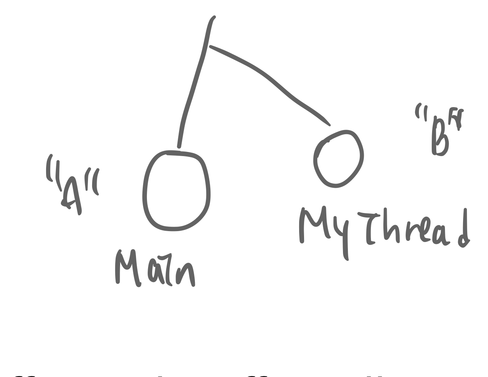

# 프로세스 동기화, 임계구역 문제

## contents

-   [Thread(쓰레드)](#Thread)
-   [프로세스 동기화](#프로세스-동기화)

# Thread

쓰레드란, 프로그램 내부의 흐름을 말한다. 보통 1개의 프로그램에는 1개의 흐름이 존재하지만, 여러개의 흐름이 존재하는 경우 multiThread(다중 쓰레드)라고 한다.

이렇게 멀티쓰레드를 가질 수 있는 이유는, 쓰레드가 매우 빠른 간격으로 switcing 되고있기 떄문이다. 그래서 실제로 cpu는 하나이기 때문에 한개의 쓰레드만 실행될 수 있지만, 여러개의 쓰레드가 동시에 실행되는 것 처럼 느낄 수 있는 것이다.

`concurrent`[실제로는하나지만빠른스위칭때문에동시처럼보임] vs `simultaneous`[실제로2개가실행.cpu가 한개일경우 이런일은 있을 수 없음 ㅎ]의 용어도 알아두자.

예시를 보면, 사실 대부분의 프로그램은 다중 쓰레드 프로그램이다.

-   web browser - 화면 출력 Thread + 데이터 읽어오는 Thread
-   word processor - 화면 출력 Thread + 키보드 입력받는 Thread + 철자/문법/오류 확인 Thread

### Thread vs Process

사실 P1의 쓰레드가 실행되고, P1의 다른 쓰레드가 실행되고, P2의 다른쓰레드 실행.. 이렇게 사실 현대의 운영체제는 쓰레드 스위칭을 위주로 work 처리가 일어난다. 다시말해, **context switching단위가 process 가 아니라 thread 라는 것**

✨ mem의 하나의 프로세스 내에서 많은 쓰레드는 code, data를 공유한다. 하지만 stack은 공유하지 않는다.(단일 쓰레드가 끝나면 또다른프로세스의 또다른 쓰레드를 처리하러 ㅌㅌ해야하기때문. 서로 처리하는 메서드가 다를것이기 때문!!)

쓰레드의 구조를 정리해보자.

-   프로세스의 메모리 공간 공유 : code, data
-   프로세스의 자원 공유 : file, i/o
-   비공유 : 개별적인 PC(program counter), SP, registers, stack

### Example

자바 쓰레드를 보자.
자바에서 새로운 쓰레드를 만들려면, 객체로 생성해야한다. `java.lang.Thread` 임.

주요 메서드

-   public void run() # 새로운 맥이 흐르는 곳. 내부에 치환하여 여러가지 코드를 추가한다.
-   void start() # 쓰레드 시작 요청
-   void join() # 쓰레드가 마치기를 기다림
-   static void sleep() # 쓰레드 잠자기

자바쓰레드의 example 시나리오를 보자.

쓰레드가 시작되면 `run()`메소드가 실행된다 => `run()` 메소드를 치환(override)한다.

    ```
    class Test {
        private static void main(String[] args){
            MyThread th = new MyThread();
            th.start();
            while(true){
                System.out.print("A");
                try {
                    Thread.sleep(100);
                } catch (InterruptedException e) {}
            }
        }
    }

    class MyThread extends Thread {
        // 상속의 이유 : 이 메서드를 치환해주기 위해 하위클래스를 만들어 상속하게끔 함.
        // override. 치환.
        public void run() {
            while(true){
                System.out.print("B");
                try {
                    sleep(100);
                } catch (InterruptedException e) {}
            }
        }
    }
    ```

위처럼 코드를 작성해보면, A와 B가 섞여서 출력되는 것을 확인할 수 있다.

<figure>  
        
        <figcaption>example의 Thread</figcaption>
</figure>

그렇다면, 왜 쓰레드를 이야기하고있는가?

사실 프로세스 관리 부서에서해야하는 중요한 일에는 크게 두가지가 있다.

1. CPU 스케쥴링
2. Thread, Process의 동기화

# 프로세스 동기화

Process Synchronization. 하지만, 위에 쓰레드 설명에 의하면 사실은 P1, P2,,, 가 번갈아가며 처리가되는것이 아니라 각 프로세서내의 Thread1, Th2.. 가 번갈아가며 처리되는것이라고 했다. 그러므로 `Thread synchronization`이라고 할 수 있는 것!

이 프로세스 동기화를 두 부류로 나눌 수 있다.

## Independent vs Cooperating

-   Independent Processor : P1, P2 가 아무런 관계가 없는 독립적인 프로세서일 경우
-   Cooperating Processor : P1, P2가 서로 영향을 주고 받는 경우.(영향을 주던지 영향을 받던지)
    -   프로세스간 통신 ex. 전자우편, 파일 전송
    -   프로세스간 자원 공유 ex. 메모리상의 자료들, db, realtime Service ...

일반적으로 cooperating processor의 경우가 훨씬 많음

결국 프로세스 동기화는 어떤 업무를 하는가여!! 왜 동기화가중요하냐?? 동시에 접근하려하는 경우, 동기화가 잘 되지 않는다면 수강신청이나 은행계좌.. 등 다양한 서비스에서 문제가 생길 수 있다.

그래서 서로간 영향을 주는 `Cooperating Processor`의 경우에 동기화 문제가 발생할 수 있으므로 data[**Concurrent access to shared data**]의 consistency(일관성-각프로세스는 서로영향안줌)를 보장할수있어야한다는 조건이 추가된다.

☹️ 이것이 보장되지 않으면 `Data Inconsistency(데이터 모순)`의 상황이 발생할 수 있음

그래서 예제를 통해서 확인해본 결과, ex. 입출금 동작에 시간지연을 추가했더니 => 잘못된 결과값! 이 나타났다...

-   왜❓ 공통변수(common variable)에대한 동시 업데이트 (`concurrent update`)가 일어났기 때문이다.
-   해결❗️ common variable에 접근할 경우 한번에 한 쓰레드만 업데이트하도록, `임계구역 문제`를 신경써서 처리해주어야한다.
