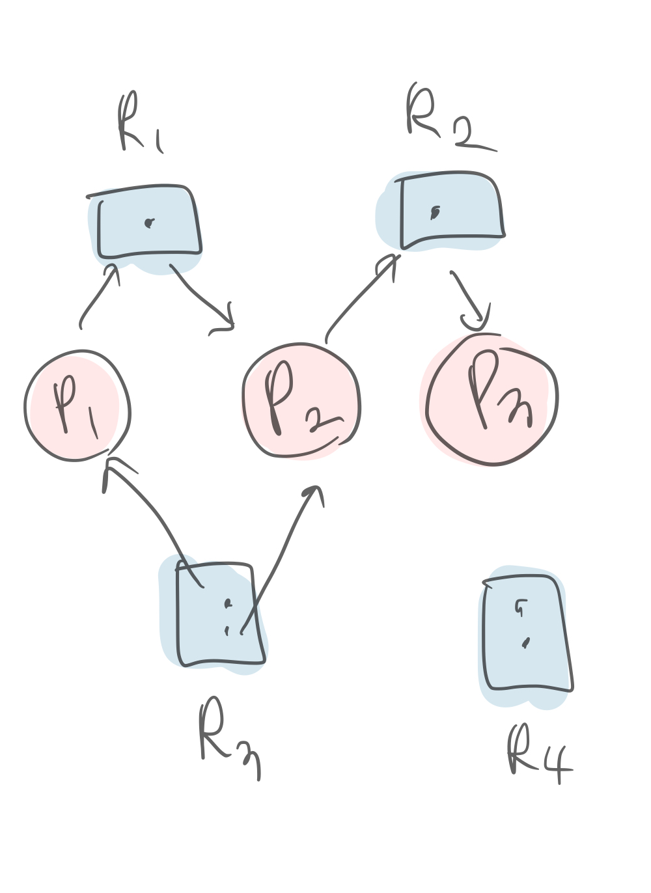

# 프로세스 동기화, 임계구역 문제

## contents

-   [프로세스 생성, 종료](#프로세스-생성과-종료)
-   [Thread(쓰레드)](#thread)
-   [프로세스 동기화](#프로세스-동기화)
-   [임계구역 문제](#임계구역-문제)
-   [Classical Synchronization Problems](#기타-전통적-동기화-문제)
-   [Deadlock](#deadlock)

# 프로세스 생성과 종료

## 프로세스 생성

-   프로세스는 프로세스에 의해 만들어진다.

    컴퓨터에서 실제 프로세스 생성과정을 보자.

    1. BOOTING : OS가 RAM 에 resident
    2. OS가 가장 먼저 첫 process를 만든다. (ex. Linux: `init`)
    3. 그 `init` 프로세스가 여러개의 프로세스들을 만든다.
    4. 그 만들어진 프로세스들은 또 자식프로세스들을 생성...

    이렇게 process Tree 를 만들고, parent process, child process, sibling process(부모같음)의 개념을 똑같이 사용한다.

-   PID(Process Identifier) : 프로세스의 각 id가 존재한다. 절대 중복되지 않음! (PPID(부모의 PID)개념도 존재)
-   프로세스 생성(system call)
    -   `fork()`: 부모 프로세스 **복사**하여 새로운 프로세스 만듬.
        -   추가 작업 없이 자원을 상속할 수 있다. 따로 초기화 작업을 또 거칠 필요 없이, 그대로 '복사'해서 쓰기만 하면 된다
    -   `exec()` : 실행파일(만들어진 프로세스)을 메모리로 가져오기
        -   PID, CID, PPID를 그대로 복사하고, 코드영역/데이터 영역만 변경하므로 `garbage collection`관리에도 용이하다 (상위 프로세스, 자식프로세스가 다 끝났는지 트래킹 등 하나하나 찾아다닐 필요 없음)
        -   프로세스는 그대로 둔 채 내용만 바꾸는 시스템 호출. 이미 만들어진 프로세스의 구조를 재활용하는 것!
        -   코드영역 - 새로운 코드, 데이터 영역 - 새로운 변수로 채워짐, 스택 영역 - PPID, PID, CID, 메모리 관련사항은 변하지 않고 PC, reg등의 값이 리셋됨. 마치 프로세스를 처음 시작하는 것 처럼 정리된다!
        -   사실 이 `exec()` 호출은 자식프로세스와의 동기화를 위한 `wait()`코드와 같이 사용된다. 자식을 `exec()`으로 호출하고, 부모를 `wait()`하게 하고, 자식이 끝나면 부모가 다시 실행되는 형식.
        -   이 명령어를 통해 프로세스간의 switching, context switching이 이루어진다.
    -   `exit()` : 해당 프로세스가 가졌던 모든 자원은 OS에게 반환
        -   자식 프로세스가 정상 종료하지 않았을 경우 부모 프로세스에게 종료를 알려주지 못하므로 garbage collection이 제대로 이루어지지않는다. 그렇게 컴퓨터에 쌓인 쓰레기 파일들이 메모리에 늘어나다보면, 느려지는 것이다. 그래서 재부팅 시에 이 모든 garbage 를 정리한다.
        -   그래서 최대한 정상 종료하는것이 중요한데, 그것이 바로 `exit()`, `return ;`이다.
        -   그리고 특히나 객체지향 프로그래밍 언어에서 모든 객체의 최상위에는 `Object`라는 클래스가 있는데, 모~든 객체는 Object 객체의 자식이 된다. (자바스크립트의 Object 를 생각하면 이해가 쉽다 )

### 조금 더, 프로세스의 동적할당/정적할당에 대해 짚고 넘어가자.

프로세스는 코드영역, 데이터 영역, 힙 영역, 스택 영역으로 구성되어있다.

<figure>
    
    <figcaption> 프로세스의 상세 구조 </figcaption>
</figure>

-   정적할당 영역 : 컴파일시 크기 결정.
    -   코드 영역 : 실제 컴파일 될 코드
    -   데이터 영역 : 작성된 코드에 있는 variable, const ... 등
-   동적할당 영역 : 런타임 시 크기 결정
    -   힙 영역 : `malloc()`등의 메모리 할당
    -   스택 영역 : 함수간의 call function(return + value 전달), scope(local Variable, global variable,,)을 구현하고 관리하는데 사용한다. 사실상 스택은 Thread가 작동하는 동안 추가/삭제되는 동적 할당 영역이다.

# Thread

쓰레드란, 프로그램 내부의 흐름을 말한다. 보통 1개의 프로그램에는 1개의 흐름이 존재하지만, 여러개의 흐름이 존재하는 경우 multiThread(다중 쓰레드)라고 한다.

이렇게 멀티쓰레드를 가질 수 있는 이유는, 쓰레드가 매우 빠른 간격으로 switcing 되고있기 떄문이다. 그래서 실제로 cpu는 하나이기 때문에 한개의 쓰레드만 실행될 수 있지만, 여러개의 쓰레드가 동시에 실행되는 것 처럼 느낄 수 있는 것이다.

`concurrent`[실제로는하나지만빠른스위칭때문에동시처럼보임] vs `simultaneous`[실제로2개가실행.cpu가 한개일경우 이런일은 있을 수 없음 ㅎ]의 용어도 알아두자.

예시를 보면, 사실 대부분의 프로그램은 다중 쓰레드 프로그램이다.

-   web browser - 화면 출력 Thread + 데이터 읽어오는 Thread
-   word processor - 화면 출력 Thread + 키보드 입력받는 Thread + 철자/문법/오류 확인 Thread

### Thread vs Process

사실 P1의 쓰레드가 실행되고, P1의 다른 쓰레드가 실행되고, P2의 다른쓰레드 실행.. 이렇게 사실 현대의 운영체제는 쓰레드 스위칭을 위주로 work 처리가 일어난다. 다시말해, **context switching단위가 process 가 아니라 thread 라는 것**

✨ mem의 하나의 프로세스 내에서 많은 쓰레드는 code, data를 공유한다. 하지만 stack은 공유하지 않는다.(단일 쓰레드가 끝나면 또다른프로세스의 또다른 쓰레드를 처리하러 ㅌㅌ해야하기때문. 서로 처리하는 메서드가 다를것이기 때문!!)

쓰레드의 구조를 정리해보자.

-   프로세스의 메모리 공간 공유 : code, data
-   프로세스의 자원 공유 : file, i/o
-   비공유 : 개별적인 PC(program counter), SP, registers, stack

### Example

자바 쓰레드를 보자.
자바에서 새로운 쓰레드를 만들려면, 객체로 생성해야한다. `java.lang.Thread` 임.

주요 메서드

-   public void run() # 새로운 맥이 흐르는 곳. 내부에 치환하여 여러가지 코드를 추가한다.
-   void start() # 쓰레드 시작 요청
-   void join() # 쓰레드가 마치기를 기다림
-   static void sleep() # 쓰레드 잠자기

자바쓰레드의 example 시나리오를 보자.

쓰레드가 시작되면 `run()`메소드가 실행된다 => `run()` 메소드를 치환(override)한다.

    ```
    class Test {
        private static void main(String[] args){
            MyThread th = new MyThread();
            th.start();
            while(true){
                System.out.print("A");
                try {
                    Thread.sleep(100);
                } catch (InterruptedException e) {}
            }
        }
    }

    class MyThread extends Thread {
        // 상속의 이유 : 이 메서드를 치환해주기 위해 하위클래스를 만들어 상속하게끔 함.
        // override. 치환.
        public void run() {
            while(true){
                System.out.print("B");
                try {
                    sleep(100);
                } catch (InterruptedException e) {}
            }
        }
    }
    ```

위처럼 코드를 작성해보면, A와 B가 섞여서 출력되는 것을 확인할 수 있다.

<figure>  
        
        <figcaption>example의 Thread</figcaption>
</figure>

그렇다면, 왜 쓰레드를 이야기하고있는가?

사실 프로세스 관리 부서에서해야하는 중요한 일에는 크게 두가지가 있다.

1. CPU 스케쥴링
2. Thread, Process의 동기화

# 프로세스 동기화

Process Synchronization. 하지만, 위에 쓰레드 설명에 의하면 사실은 P1, P2,,, 가 번갈아가며 처리가되는것이 아니라 각 프로세서내의 Thread1, Th2.. 가 번갈아가며 처리되는것이라고 했다. 그러므로 `Thread synchronization`이라고 할 수 있는 것!

이 프로세스 동기화를 두 부류로 나눌 수 있다.

## Independent vs Cooperating

-   Independent Processor : P1, P2 가 아무런 관계가 없는 독립적인 프로세서일 경우
-   Cooperating Processor : P1, P2가 서로 영향을 주고 받는 경우.(영향을 주던지 영향을 받던지)
    -   프로세스간 통신 ex. 전자우편, 파일 전송
    -   프로세스간 자원 공유 ex. 메모리상의 자료들, db, realtime Service ...

일반적으로 cooperating processor의 경우가 훨씬 많음

결국 프로세스 동기화는 어떤 업무를 하는가여!! 왜 동기화가중요하냐?? 동시에 접근하려하는 경우, 동기화가 잘 되지 않는다면 수강신청이나 은행계좌.. 등 다양한 서비스에서 문제가 생길 수 있다.

그래서 서로간 영향을 주는 `Cooperating Processor`의 경우에 동기화 문제가 발생할 수 있으므로 data[**Concurrent access to shared data**]의 consistency(일관성-각프로세스는 서로영향안줌)를 보장할수있어야한다는 조건이 추가된다.

☹️ 이것이 보장되지 않으면 `Data Inconsistency(데이터 모순)`의 상황이 발생할 수 있음

그래서 예제를 통해서 확인해본 결과, ex. 입출금 동작에 시간지연을 추가했더니 => 잘못된 결과값! 이 나타났다...

-   왜❓ 공통변수(common variable)에대한 동시 업데이트 (`concurrent update`)가 일어났기 때문이다.
-   해결❗️ **common variable에 접근할 경우 한번에 한 쓰레드만 업데이트하도록**, `임계구역 문제`를 신경써서 처리해주어야한다.

즉, 동기화의경우 atomic하게. 동시에 접근하지 못하게 해야한다.(도중에 context switching이 일어나면 안된다.)

# 임계구역 문제

## Critical Section, Critical Section Problem

-   Critical Section(어떤 특정 코드가 작동하는 영역) Problem[임계구역 문제] : `common variable`을 update하는 구역에 생기는 문제들을 말한다. common variables 부분을 update하거나 write 하는 경우..
-   다시한번 정리해보면 Critical Section : 하나의 시스템에는 여러개의 쓰레드(멀티 쓰레드)로 구성되어있는데, common으로 사용하는 부분이 있다. 그 부분을 업데이트 하는 부분의 코드를 말한다.
-   예를들어, Parent 클래스에서 계좌의 balance에 접근하여 연산하고, Child클래스에서도 계좌의 balance에 접근하여 연산하는 코드가 있을 텐데, 그 코드부분을 Critical Section이라고 한다.
-   common variables의 예 : 같이 사용하는 영역의 variable, file, code, db ...

### 임계구역 문제의 Solution

-   Mutual Exclusion(상호배타) : 오직 한 쓰레드만 진입가능하게 한다.
    -   ex. Parent <-> Child 둘중 하나만 들어갈수있게 한다.
-   Progress(진행) : 정해진 시간(유한 시간)내에 입장을 결정한다.
    -   ex. 유한시간 내에 Parent, Child 둘 중 누가 먼저 들어갈것인지를 결정한다.
-   Bounded Waiting(유한 대기) : 어떤 스레드라도 기다리고있다면 유한 시간 내에는 꼭 Critical Section안에 들어갈 수 있어야한다.

이 세가지가 전부 만족되어져야 Critical Section Problem을 Solution 할 수 있다.

## 프로세스/쓰레드의 동기화

-   임계구역 문제 해결(Mutual Exclusion, Progress, Bounded Waiting) : 틀린답이 나오면 안됨
-   프로세스 실행 순서 제어 : 원하는대로 실행순서를 제어할 수 있어야한다
-   Busy wait 등 비효율성은 제거 ~~나중에 더 추가로 나올예정~~

### ✏️현재까지의 정리

OS는

1. Process Management
    - CPU Scheduling : ex. FCFS, RR, SJF ...
    - Synchronization : for 임계구역문제 해결, 프로세스 실행순서 제어, 비효율성 체크
2. Main Mem Management
3. File System
4. I/O

를 해야한다고 배웠다.
그런데, 동기화이야기가 갑자기 왜 나오냐 ?!?

컴퓨터의 자원은 한정되어있고, cpu에서만 작업을 처리할 수 있다. 메모리에서는 기다리고있었다가, 작업 처리를 대기할뿐. 하지만 컴퓨터 작업은 최대한 빨리 처리되는게 좋기 때문에, Synchronization 을 통해 (ex. TSS도 그렇고) 프로세스를 처리시키고 아웃시키고 다시들어오게하고.. 너무 작업이 길어진다면 내쫓기도 하고.. 하는데 그때 그 자원/데이터의 효율적인 처리를 하기위해, 상호 독립적으로 프로세스를 처리하기 위해서 필요한 개념이 Synchronization이다.

그래서 아주 빠른 시간내에 빠른 switching & process 가 일어나는 Sync로 인하여, 서로의 상태를 주시하며 코드가 서로 간섭하지 않게 하려면 임계구역문제를 해결해야하고, 프로세스의 실행 순서를 제어할수있게 해야하고 비효율성을 체크해야한다는 것이다.

그렇다면 그 동기화를 어떻게 꼬이지 않게 할수있는건지, Synchronization Tools에 대해 한번 알아보자.

## 동기화 도구(Synchronication Tools)

-   Semaphores
-   Monitors ex. JAVA에서 많이 씀

가 있다. 그중에서, 동기화를 의미있게. 가능케하는. 몇가지 Tools를 알아보자.

### Semaphores (세마포)

-   동기화 문제 해결을 위한 sw 도구
-   쉽게말하면 A class와 B class~~둘이부모자식관계가아닐수도있음~~가 Critical Section을 가질 경우(공통된 common variables를 가지고있을경우) A class 가 들어가면 B 클래스를 들어가지 못하게 하는 개념이다
-   구조 : 정수형 변수 + P, V동작(2가지 mode)
    -   `P` : 정수값을 검사한다. test -> acquire()
        ```
        void acquire() {
            value--;
            if(value < 0) {
                add this process/thread to list; // 어떤 프로세스나 쓰레드가 acquire()을 실행시키면 list(queue)에 집어넣고
                block; // 누가 꺼내기 전까지는 멈춰있는다
            }
        }
        ```
    -   `V` : 정수값을 증가시킨다. increment -> release()
        ```
        void release() {
            value++;
            if(value <= 0){
                remove a process P from list; // 어떤 프로세스나 쓰레드가 release()를 실행시키면 list(queue)에서 뺄것이다
                wakeup P; // Queue(list)에서 해방시킨다
            }
        }
        ```
    -   마치 스택에서 push, pop 을 하듯 release, acquire가 있다고 생각하면 편할듯 하다.

시나리오를 한번 그려보자.

Parent, Child 클래스 내부에 balance에 접근하는 연산코드가 있다.

1. Parent가 접근하는 동안에는 Child는 접근을 금지시키려한다.
2. 그러면 `p.acquire()` -> balance연산 -> `p.release()` 순서로 코드 사용이 되는데
3. 그떄 release에서 value++;하게되고
4. child가 해당 영역(Critical Section)의 코드를 사용하려고 하면, (`c.release()` -> balance연산 -> `c.acquire()`가 진행되려고 할 때)
5. child는 release() 연산에서 if에서 걸려서, process/thread 가 queue(list)에 대기하게된다.

> > Sync되게 사용할 경우 (쓰레드 겁나 빨ㄹ리 스위칭하는경우) 지연시간이 있으니까, context switching이 이루어지면서 Critical section 문제를 해결할 수 없었는데 Semaphore를 사용함으로써 Critical Section Problem을 해결!!

실제로 Semaphore docs를 읽어보면 exception 처리 (sw interrupt)를 하는 코드가 실제로 써있다. acquire시 try catch로 막아버림. 그래서 지연시간이 길던 짧던, 정확한 결과를 가져올 수 있는것이다. Critical Section 에서 서로 간섭할 수 없도록 만든게 세마포.

---

# 기타 전통적 동기화 문제

-   [Producer and Consumer Problem](<(#생산자-소비자문제)>)
    -   생산자-소비자 문제 = 유한 버퍼 문제(Bounded Buffer Problem)
-   [Readers-Writers Problem](#readers-writers-problem)
    -   공유 데이터베이스 접근
-   [Dining Philosopher Problem](#dining-philosopher-problem)

## 생산자-소비자 문제

(Producer-Consumer Problem)

생산자가 데이터를 생산하면 소비자는 그것을 소비한다. 예를들어
소스코드를 -> compiler(생산자)가 어셈블리 코드로 만들어 -> 어셈블러(소비자)가 기계어로 만들어.. 이 번역 과정을 거쳐서 가는 전체 과정에서도 생산자-소비자를 이야기할 수 있다.

위와같은 맥락으로 생산자>소비자 : 컴파일러 > 어셈블러, 파일서버 > 클라이언트, 웹서버 > 웹클라이언트 등의 예가 존재한다.

producer processor가 -> buffer에 저장`Bounded Buffer` -> consumer가 바로 소비하는 과정을 거친다. 여기서 Bounded Buffer는 다음과같은 특징을 가진다.

-   생산된 데이터는 일단 버퍼에 저장한다
-   현실 시스템에서 버퍼의 크기는 **유한**하다(Bounded 라는 뜻!)
-   생산자는 버퍼가 가득 차면 더 넣을 수 없다.
-   소비자는 버퍼가 비면 소비할 수 없다.

```
class Buffer {
    int[] buf;
    int size;
    int count; // Bounded Buffer에 들어가있는 개수
    int in; // Buffer을 in(초깃값 : 0)
    int out;
    Semaphores mutex; // import java.util.concurrent.Semaphores

    Buffer(int size) {
        buf = new int[size]; // Bounded Buffer(유한 크기)
        this.size = size;
        count = in = out = 0;
        mutex = new Semaphore(1);
    }
}

void insert(int item) {
    while(count == size){
        // buffer is full
    }

    //////////// Critical Section /////////////////
    mutex.acquire(); // 세마포

    buf[in] = item;
    in = (in+1)%size;
    count++;

    mutex.release(); // 세마포
    ///////////////////////////////////////////////
}

void remove() {
    while(count == 0){
        // buffer is empty
    }
    //////////// Critical Section /////////////////
    mutex.acquire();

    int item = buf[out];
    out = (out+1)%size;
    count--;

    mutex.release();
    ///////////////////////////////////////////////
    return item;
}

class Producer extends Thread {
    Buffer b;
    int N;
    Producer(Buffer b, int N) {
        this.b = b;
        this.N = N;
    }
    public void run() {
        for(int i=0 ; i<N ; i++) b.insert(i);
    }
}

class Consumer extends Thread {
    Buffer b;
    int N;
    Consumer(Buffer b, int N) {
        this.b = b;
        this.N = N;
    }
    public void run() {
        for(int i=0 ; i<N ; i++) item = b.remove();
    }
}

class Test {
    public static void main(String[] arg){
        Buffer b = new Buffer(100);
        Producer p = new Producer(b, 10000); // 생산해서 넣고.. 10000번 반복
        Consumer c = new Consumer(c, 10000); // 10000번 소비
        p.start();
        c.start();
        try {
            p.join();
            c.join();
        } catch (InterruptedException e) {}
        System.out.println("Number of items in the buffer is " + b.count); // buf 몇개 남았는가. 정상적으로 동작했다면 0이 나와야 정상.
        // 동기화가 되지 않으면 0이 나오지 않음
    }
}
```

이 예제에서 Semaphore처리부분을 제거한다면 잘못된 결과가 나온다. `count !=0`이거나, 심지어 실행이 되지 않는 경우도 존재한다. ~~여기서는 binaty Semaphore을 예시로들고있다. 참고로 세마포와 Lock은 작ㄱ동 원리가 반대이다.~~

❓ 원인은?

-   Critical Section Problem 떄문이다. 공통변수 업데이트 구간(임계구역)에 대한 동시 진입이 있기 때문이다. => buffer를 바꾸는 도중에 switching이 일어나기 때문.
-   공통변수 count, buf[] 에 대해 동시에 업데이트 하려고 해서 생기는 문제
-   atomic instruction이 아니기 때문에 == 인터럽트가 발생될 가능성이 아주 낭낭!하다 == context switching 이 발생할 수 있고 == 동시 접근을 허용하게될수도 있다 는 파생되는 여러가지 문제점이 생길수있는 것이다.

❗️Solution

-   Critical Section 안에 Producer 가 들어가면 Consumer는 절대 들어가지 못하도록, `세마포`를 사용하여 Producer: 10000번 도는동안 연산들어갈때 `mutex.acquire();`, 나오면서 `mutex.release();` mutex는 mutual exclusion의 약자, rel; Consumer: 10000번 도는동안 들어가면서 `mutex.acquire();`, 나오면서 `mutex.release();` 해주어 `mutual exclusion`하도록 처리해주어야한다.

-   buffer가 꽉차면 세마포 감옥에 가두어버리고, block 되어버린다.

그렇다면, 위같은 Critical Section Problem이 존재하는 value++등의 연산을 해주기 전에 single CPU일 때 사용하는 방법같이 `lock()`을 해주는 방법으로 막아버리는 방법이 존재하는데 그렇게 `lock()` 해주면 `busy waiting`한다고 한다. (사실 이는 짧은 Critical Section에만 사용하는게 좋다고 한다. 왜냐면, 그 임계영역이 길어질수록 오랫동안 busy-waiting을 해야하기 때문이다.)

### Busy-wait

인 상황이라면, 생산자와 소비자는 각각

-   Producer : Buffer가 가득 차면 기다려야함 = `empty` 공간이 있어야함
-   Consumer : Buffer가 비면 기다려야함 = `full` 공간이 있어야함

이런 동작을 해야한다. 세마포를 이용해 `busy-wait`을 회피해보자. 아래의 코드는 개념을 정리하기에 좋고 굉장히 중요하니 설명할 수 있어야한다. Semaphore 형 변수를 `empty`, `full`, `mutex` 세가지로 사용하는 경우이다.

-   Producer : `empty.acquire()` `full.release()`// defaultVal = BUF_SIZE
-   Consumer : `full.acquire()` `empty.release()`// defaultVal = 0

Producer가 꽉찼으면 Consumer에게 하나 빼주라고, 그래야 내가 넣을수있다!! 하는 꺠워주는 작업이 필요하다. 그래서 소비자가 `empty.release()` 해주면 Producer가 깨어나서 이제 다시 들어가게해줌.

## Readers Writers Problem

데이터베이스를 공통으로 사용하기떄문에, 문제들이 생긴다.

-   Readers : 오직 읽기만 ㄱㄴ, 수정 ㅂㄱ
-   Writers : 읽기 ㄱㄴ 수정 ㄱㄴ

보통 공통으로 접근해서 생기는 문제를 해결하기위해서는 DB접근 자체를 Critical Section으로 만들어 두면 되지만, 보통의 경우처럼 한번에 한개의 프로세스만 접근을 허용하게 하는 것은 굉장히 비효율적이다.

특히나, Reader가 1명 들어오건 100명 들어오건 내용이 변화할 일은 없기 때문에 Reader는 상관이 없다. 그렇기때문에 한 Reader가 들어가면 Writer는 못들어오게 하되, 다른 Reader들은 들어올 수 있게 해줘야한다.

이러한 R/W들이 들어와서 생기는 problem을 case로 나누어보면 다음과같은 경우들이 존재한다.

-   First R/W problem (readers-preference) : 항상 Reader에게 우선권을 주고, Writer가 미루어지는 경우
-   Second R/W problem (writers-preference) : 항상 Writer에게 우선권을 주고, Reader가 미루어지는 경우
-   Third R/W problem : 아무에게도 우선권을 주지 않는 경우

## Dining Philosopher Problem

5명의 철학자, 5개의 젓가락1짝으로 각각의 철학자가 식사할수있는경우를 따진다. 철학자는 항상 식사를 하거나 생각을 한다. 이러한 문제를 프로그래밍으로 생각해보면,

-   철학자 : Thread
-   젓가락 : 각각이 semapho(# innitialValue = 1)
-   젓가락을 드는 순서: 왼쪽 acquire -> 오른쪽 acquire -> 식사 -> 왼쪽 relieve -> 오른쪽 relieve -> 생각 -> 왼쪽 acq... 으로 정형화한다.

위 경우를 코드로 작성하면, 계속 무한히 반복할 경우 어느정도 실행되다가 중지된다. 바로 `deadlock(교착상태-암것도못함)` 동기화 문제 떄문이다. ~~이런경우를 생각해야함~~. 이 상황에서는, 모든 철학자들이 식사하려고 왼쪽 젓가락을 acquire 하였을 경우가 바로 문제가 되는 것이다.

한번 다시 정리를 해보자.

-   OS에서 가장 중요한게 프로세스 관리
-   프로세스 관리에는 크게 CPU 스케쥴링, 프로세서 Synchronization(동기화) 가 있었다
-   프로세스 동기화를 정상 동작하게 하기 위해서 해결해야 하는 문제들이 있는데, 크게는 임계구역문제 해결, 프로세스 실행순서 제어, 비효율성 체크
-   특히나 동기화에서는 위의 방식을 사용하던, 사용하지 않던 교착상태(Deadlock)에 빠지게 되는 경우가 분명히 존재한다.

# Deadlock

프로세스는 실행을 위해 여러 hw자원(resources)을 필요로한다. 그리고 이 자원을 사용하는 application들이 있다. OS는 그 자원을 잘 나누어주어야한다.

예를들어 아래와같은 상황이 발생하면서도 공교롭게도 가끔, 아차! 싶으면, 교착상태가 발생한다.

-   P1이 자원의 일부는 가졌으나 일부자원A는 가지지 못했을 떄, `waiting`해야한다.
-   다른 프로세스P2가 자원A을 가지려고 `waiting`하고있었을 때 둘다 기다리는 상태이므로 교착상태(Deadlock)의 가능성이 존재한다.

이 4가지가 모두 만족될 때, 교착상태가 일어날 **수도**있다.

-   Mutual exclusion : 상호 배타. 한사람이 쓰고있으면 다른사람이 쓰지못하는 경우
-   Hold and wait : 어떤 자원을 가지고있으면서 대기하고있을 때
-   no Preemption : 비선점. 갖고있는걸 강제로 뺏을 경우. 하지만 보통 동기화의 경우 강제로 뺏는 경우란 존재하지 않는다. 그래서 생기는 문제임.
-   Circular wait : 사이클이 하나의 원을 이루기 때문에 (모두 왼쪽을 대기중.. 이런거)

실제 컴퓨터에서 deadlock이 발생하면, pc의 경우에는 pc가 전원은 켜져있지만 아무런 작동을 하지 못하는 것이다. 그래서 전원을 껐다 켜야하는 경우가 발생함. 그저 개인용 PC이라면 매우 심각한 문제는 아니겠지만 서버컴퓨터라던가, 임베디드의 수많은 기계들에서, 은행/증권에서도 굉장히 심각한 문제를 발생시킨다.

그래서 OS에서는 **deadlock**이 생기지 않도록 조치를 미리 취해줘야한다.

## 자원(Resources)

결국 Deadlock이 발생하는 이유는, 자원전쟁! 때문에 일어나는 것이다.

### 자원의 사용

자원의 사용은 `request` -> `use` -> `release`의 순서로 이루어진다.

-   자원을 사용하려고 한다면, OS에게 CPU 가 요청한다. 이 자원을 쓰겠다 !! 하고
-   자원을 다 사용한 후에 OS에게 잘썼슴! 하면서 해당 자원을 반납.
-   그 자원 사용하려는 대기하고있는 다른 프로세스가 요청 ...

이렇게 자원을 할당받아 사용한다.

### 동일 자원

하지만, 동일한 자원(type...)이 2개이상 있는 경우도 있다. 예를들어 print를 두개 연결했다거나.. 램 두개 똑같은거 꼈을때나.. 같은 경우를 말한다. 이때 동일한 자원 각각을 instance라는 용어를 사용한다.

### 자원 할당도(Resource Allocation Graph)

이 시스템 내에 어떤 자원이 있고 그 자원이 어떤 프로세스에게 할당되었나!? 누가 또 그 자원을 할당받으려고 기다리고있나 !? 를 표현할수있는 그림.

자원: ㅁ, 프로세스: ㅇ, 할당: -> 로 표현한다.



위 그림을 보면

-   Resource4는 아무런 프로세스에 의해 사용되지 않고있음
-   R3는 두개의 동일 리소스를 가지고있으면서 P1, P2에게 할당중
-   P2는 R1을 사용하고있고 P1은 R1을 사용하려고 기다리고있음

이렇게 자원할당도를 그렸을 때, deadlock이 발생하기 위한 필요조건은!! 자원 할당도 상에 원이!! 만들어져야한다. (circulate로 보여질 때 )

위 그림에서는 deadlock이 일어날 일이 없음! (화살표)

### 교착상태의 처리

교착상태를 handling하는 방식에는 4가지가 있겠다.

-   deadlock Prevention : 교착상태를 방지한다
    -   ## 교착상태 4가지 필요조건(mutual ) 중 한가지 이상 불만족
-   deadlock avoidance : 교착상태를 회피
-   deadlock Detection & recovery : 교착상태 검출, 복구
-   Don't care : 무시
