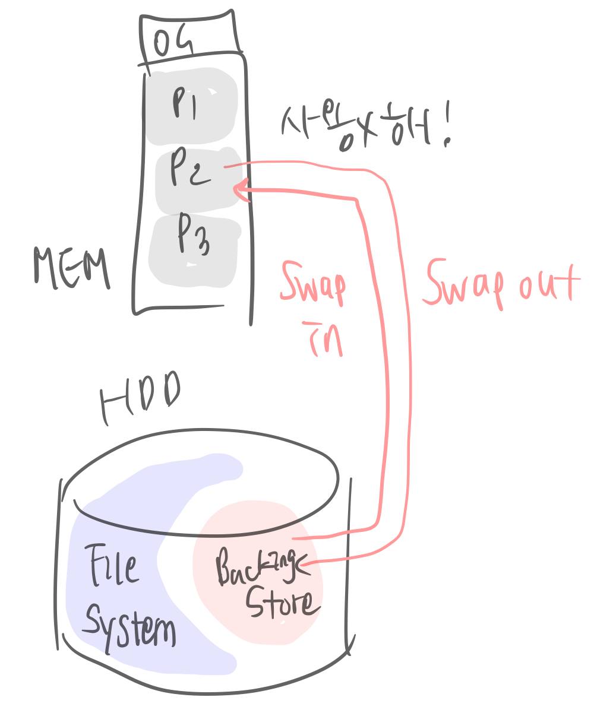
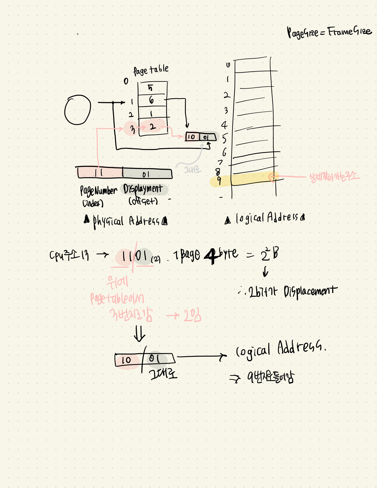
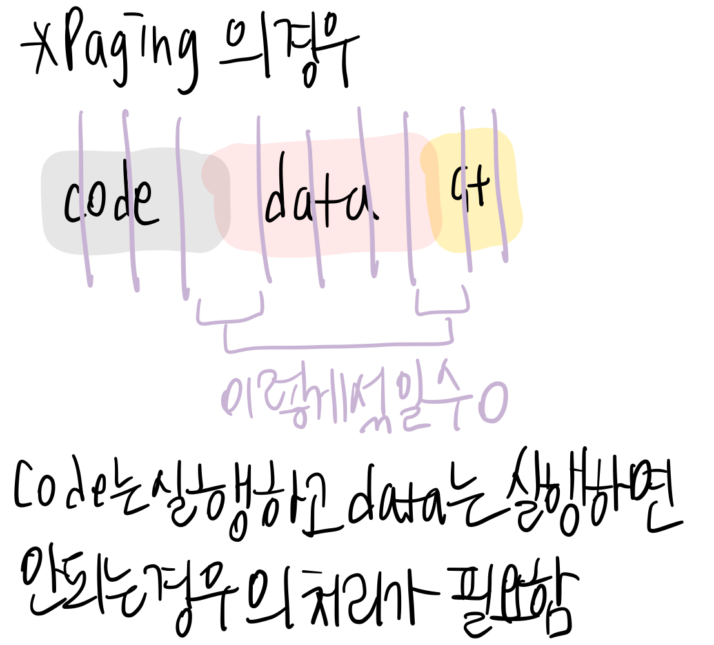

# 메모리

## contents

-   [주기억장치 관리 개요](#주기억장치-관리-개요)
-   [메모리 절약](#메모리-절약)
-   [연속메모리할당](#연속-메모리-할당)
-   [Paging 페이징](#paging)
-   [segmentation 세그멘테이션](#segmentation)

# 주기억장치 관리 개요

메모리용량도 많이 늘어났지만 처리하는 데이터(프로그램)가 더 커졌고, 처리도 빨라져야한다. 메모리는 언제나 부족하다. 그래서, 메모리가 작은데 어떻게 하면 효과적으로 메모리를 사용할 수 있는가 !!

## 메모리 구조

메모리 = address + data로 구성되어있고, 프로그램의 실행에 관여하는 파일들은 다양하다.

-   source file : 어셈블리언어, high-level 언어 -> 이후 `compile`
-   object file : 컴파일, 어셈블 결과 010101 -> 이후 다양한 obj 파일(컴파일한 소스파일, library) `link`
-   executable file : 링크 결과로, 실행파일 (.exe) -> main.exe가 `HDD`에 있음
-   위 main.exe를 `main memory`에 `load` 하여 `실행`시킴
-   RAM에 프로그램이 load 되면, code, data, stack segment가 관여한다.

프로그램을 메모리에 올리는 과정을 좀 더 상세하게 생각해보자.

실행파일을 메모리에 올린다는 것은, **어디로** **어떻게** **어떠한 status bit들과함께** **꼬이지않게** 올릴지가 결정되어야한다는 뜻을 말한다. 그저 올리면 되는게아님 !!

-   메모리 몇번지에 올릴것?
-   다중 프로그래밍 환경에서는 꼬이지 않게 어떻게 처리할것?

예를들어 위와같은 치명적인 문제를 해결하기 위해서, 메모리 관련하여 몇가지 처리를 한다.

-   MMU의 `Relocation register`  
     : 해당 프로세스는 본인의 지정된 메모리 번지만 읽을 수 있다는 MMU의 다른 역할인데, Relocation register에 들어간 값 0x500이 항상 주소계산에 더해지는 값이 된다. 이 relocation register를 사용하면 메인메모리 어디에 있던지 상관없이(ex. 0x500~ 0xxxx ), cpu관점에서는 0번지~~ 0xxxx-0x500 번지에서 사용하는 것 처럼 인식 -> MMU가 항상 0x500을 더해줘 OS가 그 레지스터를 보고 주소계산을 해서 메모리에 접근!! => addresss bit 가 줄어듬!! ~~왜 이렇게 하나 싶었는데 주소표현에 사용하는 비트를 줄일수도있고해서 좋은듯!!!~~)

> CPU가 보는 주소(logical address) + MMU = MEM이 보는 주소(physical address)

컴퓨터구조에서는 논리주소, 물리주소를 구분하지 않았는데 MMU를 통해 이제 실제 주소 체계를 알게되었스요 ㅎㅎ

그래서 우리는 메인메모리 어디에도 프로그램을 올릴 수 있다!

# 메모리 절약

## 메모리 낭비 방지

운영체제는 자원을 빠르게 사용, 효율을 높게하는데에 목적이 있다.

-   Dynamic Loading(동적 적재)
-   Dynamic Linking(동적 링킹)
-   Swapping

크게 3가지가 있다.

### Dynamic Loading

프로그램 실행에 반드시 필요한 루틴/데이터만 적재한다. 보통 코드는 핵 많지만, 실제로 사용되는 데이터는 전부가 아니다.

-   모든 routine이 다 사용되는 것은 아님(ex. Error처리 : 오류가 일어나지 않으면 괜히 올림 ㅎㅎ... ) -> 오류가 일어나면 그때 load
-   모든 data가 다 사용되는 것은 아님(ex. Array)
-   JAVA : 모든 클래스가 다 사용되는 것은 아님

이러한 경우가 많기 때문에, 실행 시 필요하게되면! 그 때 해당부분을 메모리에 load 한다는 개념이다.

현대의 OS들은 대부분 Dynamic Loading 함!! windows, MacOS, Linux ...

Static Loading <-> Dynamic Loading

### Dynamic Linking

여러 프로그램에 공통으로 사용되는 라이브러리루틴을(Library Routine)메모리에 중복으로 올리는 것은 낭비아닌가! 하는데서 나온 개념.

-   .exe 실행파일을 만들 때 link 하는게 아니라 라이브러리 루틴 연결을 실행시까지 미루고
-   MEM에 오직 하나의 lib 루틴만 load 되고,
-   다른 애플리케이션 실행 시 이 lib 루틴과 link 된다

ex. P1도 printf, P2도 printf를 사용한다고 하면 똑같은 코드인 printf를 두번 load 할 필요 없다는거임!! 하나만 MEM에 올려놓고, 필요할 때 그 올려진 기계어 코드를 memory에서 link해줌

ex. ftp, email 프로그램에서 똑같이 network lib를 사용하는데 둘다 올라가면 메모리 낭비니까 ㅎㅎ 하나만 MEM에 올리고 필요할 때 그 올려진 network 기계어 코드를 memory에서 link 해줌

Dynamic Linking(실행 이후 메모리에서 link) <-> Static Linking(실행파일 만들 때 link)

위와같은 Dynamic Linking 의 운영체제별 동적 링킹 파일을 보면,

-   Shared Library(동적 라이브러리) - Linux
-   DLL(Dynamic Linking Library, 동적 연결 라이브러리) - Windows

들의 이름으로 존재한다.

### Swapping

메모리의 활용도를 높이기 위해 메모리에 적재는 되어있으나 현재 사용되지 않고 있는 프로세스이미지는 잠시 내쫓는다는개념이다. ~~이미지 : 현재 프로세스가 실행되고있는 일부분~~

<figure>  
        
        <figcaption>Swap-in, Swap-out</figcaption>
</figure>

-   OS : 엥? 이 P1 실행 안하고있네 ?
-   지금은!! 메모리에서 일단 내쫒음 ㅌㅌ
-   **Swap-out** : 실행파일의 일부(프로세스 이미지)는 메모리에서 HDD의 Backing Store(=Swap Device)로 이동( != HDD의 FileSystem 부분~~과 다른 영역의 HDD~~)
-   **Swap-in** : 이후 call 되면 다시 호출하여 사용

❓ Backing Store의 크기는 어느정도가 되어야할까 ??
❗️ 메인메모리에 적재되었다가 필요없어지는 프로세스[프로그램]을 하드의 backing store 로 이동하는거니까, MEM - OS의 크기.. 버퍼 잡아 MEM의 크기정도만 되면 될듯 !! ~~OS에서 가상메모리 지정하듯이 지정할 수 있음~~

-   Relocation register의 사용으로 인해, 하드에 적재되는 위치는 무관하다
-   프로세스 크기가 크면 backing store 입출력에 따른 부담이 크다

# 연속 메모리 할당

현대의 OS는 멀티 프로그래밍 환경이다. 그래서 부팅 직후에 메모리 상태는, 하드디스크에서 load -> load -> load ... 해서 `OS` 와 `program[process]`들이 적재되고, 일부 공간은 남는다(`hole`)

그리고 프로세스의 생성과 종료를 반복하면서, hole이 프로세스가 사라진 위치가 되므로 scattered Hole.. 그래서 이렇게 memory가 단편화(segment)된다.

## Memory Fragmentation

-   Hole들이 불연속하게 흩어져있기 때문에 프로세스 적재가 불가능하다
-   외부 단편화 (external fragmentation)이 발생한다

흠 근데 프로세스의 switching은 정말 많이 일어나는데 그 횟수를 줄일수는 없다 !! 외부 단편화가 많이 생길수밖에 없고, 그러면 OS가 이 메모리내에서 hole을 또 정리해줘야하고.. 오버헤드의 증가ㅜㅜ!!

그러면 외부 단편화를 어떻게 최소화할 수 있을까? 몇가지 방법을 생각해본다.

## 연속 메모리 할당 방식

-   First-fit
-   Best-fit
-   Worst-fit

[example]  
메인메모리에 hole 들이 100, 500, 600, 300, 200 KB라고 했을 때
HDD에서 프로그램을 load하려고 한다 212, 417, 112, 426 KB 크기인 순서대로 load 하고싶다.

-   first fit : 다 못들어감
-   best fit : 다 들어감
-   worst fit : 다 못들어감

하나씩 넣어보면, 다 들어갈수 있는 경우도 존재하고 그렇지 못한 경우도 존재한다. 위 예제에서는 best fit이 가장 좋지만, 실제로 일반적인 상황에서는 어떨까?

각각의 연속 메모리 할당 방식마다 장점이 다르다.

**할당 방식 성능 비교 측면 (속도, 메모리이용률)**

-   속도 😊 : first-fit (속도 계산할 필요 없음)
-   메모리 이용률 😊 (못들어가는 경우가 적은 확률): first-fit, best-fit

그래서 우리는 first, best fit을 사용하는 것이 좋다.

❓ 하지만 이 3가지 연속메모리할당방식 모두 외부 단편화로 인한 메모리 낭비가 1/3수준에 이른다.(그 부분은 사용하지 못함 ㅠㅠ) -> 자원 낭비!!
❗️ 이 메모리 낭비의 문제를 `compaction`으로 해결해보는 경우를 생각해보자.

### Compaction

Compaction은, 메모리에 생성된 hole 들을 한곳으로 모은다는 뜻이다.

하지만 이에 따른 문제가 또 존재한다. hole들을 한곳으로 모으려고 하는데, 주소 몇번지로 옮기는게 좋을까?? -> 이에 따른 최적 알고리즘은 존재하지 않는다. 그래서 부담이 크다는 큰 단점이 존재한다.. ㅠㅠ

그래서 이 문제도 사용 불가능..! 그래서 메모리 자원을 효율적으로 사용하는 방법으로 고안되어 현재까지도 사용중인 방법이

# Paging

페이징이다. 페이징은, 프로세스를 일정크기(= page )로 잘라서 메모리에 넣는다.
메모리 전체를 일정 크기(page 크기 = frame크기)로 잘라서 프로세스를 연속해서 올리지 않고, 여러개의 페이지로 잘라 HDD에서 memory로 load 한다.

실제로 메모리는 잘렸지만, CPU는 메모리상의 연속된 프로세스로 인식하는 것이다.
용어를 정리해보자.

-   page : process 자른거
-   frame : memory 자른거

당연히 메모리에있는 프로세스가 cpu로 가게되니, `page 크기 = frame 크기`이다. 하지만 용어로 구분한다.

-   Process : page들의 집합
-   Memory : frame들의 집합

❓ 하지만, 프로세스가 이렇게 잘려있으면 어떻게 실행을 시킬까?
❗️ CPU 를 속인다. 메모리 주소를 넘겨주면서, 연결된 것 처럼 CPU에게 넘겨주면 **연속된 프로세스인것 처럼 mapping하여** 보여줄 수 있다.

페이징 덕에 외부 단편화 문제는 이로써 모두 해결!!
그렇다면 페이징에서 주소변환은 어떻게 일어나는것인가??

## Address Translation(주소변환)

실제로 주소의 종류는 2가지라고 했다.

> CPU가 보는 주소(logical address) + MMU = MEM이 보는 주소(physical address)

그에 따라 논리주소는 우리가 말하는 논리주소, 물리주소는 실제 1010의 주소. 따라 변환이 필요하다.

1.  Logical address(논리주소)

        CPU가 표현하는 주소

        

        -   CPU가 내는 주소는 2진수로 표현한다 (전체 m bits)
        -   하위 n bits는 offset || displacement
        -   상위 m-n bits는 Page 번호를 표현할 bits

한 페이지가 1KB = 2^10, n(page size) = 10 bits

2.  Physical address(논리주소 -> 물리주소로 변환)

        메모리가 표현하는 주소
        -   페이지 번호(p)는 페이지 테이블의 index 값! 해당 프로세스가 페이지 몇개를 사용하는지에 따라 결정
        -   p에 해당되는 테이블 내용이 프레임번호(f)
        -   변위(d)는 변하지 않음

❓[Example]
CPU가 50번지. 한페이지당 16 B. 메인메모리에서는 몇번지?

-   50 = 110010 -> 상위 2비트
-   page size : 16 B = 2^4 B = 2^6 bits => 6비트로 주소 표현,(위 50이 6자리니까 그대로 둠) / 2bits : page table Index(주소), 4bits가 displayment
-   displayment 는 해당table 에 8이 들어갔다고 하면,
-   **11** / 0010 : page table에서 11(3번째) 주소 안에 있는 값인 8이 들어가있으면 -> **실제로 메인메모리의 주소는 8**(frame number)
-   11 / **0010** : 10진수로 **2**(displayment)
-   => 합쳐서 **8 2** : 1000 0010 = 130

❗️CPU의 logical address 50번지는 메인메모리의 130번째 번지에서, 8(frameNumber : 몇번째 페이지로 갈까?)번쨰 frame은 실제로 메인메모리의 시작번지 128번지에서 시작한다(2bits : page table)

이후 Process 가 frame크기별로 쪼개져 순서가 주어지면, 그대로 들어간다.

이렇게 `Paging`으로 외부 단편화 문제를 해결했다.

[Example]
이 페이징 주소변환부분은 중요한 부분이니, 예제를 한번 더 풀어보자.

page table 이 주어지고, physical Address 10진수 13, page size = 4B일 때 logicalAddress는?

기사시험에서도, 실제 시험에서도 많이 나오는 문제니 풀줄 알아야한당 !

## 내부 단편화(Internal Fragmentation)

프로세스의 크기가 페이지 크기의 배수가 아니라면, 최소한 마지막 페이지는 한 프레임을 다 채울 수 없다.

결국, 남은 공간 == 메모리가 낭비된다.
페이징은 외부단편화 문제를 해결헀지만, 이 문제는 ㅠㅠ 페이징을 써서 해결할 수 없는 문제다.

하지만 다행스럽게도, 내부단편화는 아주 미미하다. 왜냐하면 페이지의 크기가 아무리 크다고 해도 외부단편화에 비해서는 굉장히 미미한 !! 크기이기 때문!!!

> 내부단편화 = page size - 1byte

아쥬 미미한 크기이기 때문에, 크게 문제되지는 않는다.

그리고 여기서 컴구때 배웠던 `TLB(Translation Lock-asdice Buffer)`가 나오는데, cpu보다는 속도가 느리지만 메모리보다는 속도가빠른 중간 속도를 갖는 페이지 테이블이다. 그래서 TLB 에 있는 데이터를 불러올때는(hit일 경우), 시간을 훨씬 줄일 수 있어 효율적이다.

## 페이징의 보호와 공유

운영체제가 하는 일중 중요한일 중 하나가 보호인데, 페이징을 할 경우 보호를 어떻게 할까?

-   **보호(Protection)** : 해킹을 방지. 모든 주소는 페이지 테이블을 경유하므로 페이지 테이블 엔트리마다 r, w, x(read, write, execute) 비트를 두어서 해당 페이지에 대한 접근제어를 가능하게끔 한다.
-   **공유(Sharing)** : 메모리 낭비를 방지. 같은 프로그램을 쓰는 복수개의 프로세스가 있다면, code, data, stack 중에서 code는 공유가능하다. 프로세스의 페이지 테이블 코드 영역이 같은곳을 가리키게한다.
-   non-self modifying code = reentrant code = pure code : 재진입이 가능 한 코드. 코드변경이 없다는 의미! 공유가 가능하려면, 이렇게 코드변경이 없어야만 한다.

# segmentation

프로세스를 일정크기로 자르는게 paging이었다면, 이제는 논리적 내용( = segment)로 잘라서 메모리에 배치하자! 이렇게 자르는게 segmentation이라고 한다.

-   프로세스 = segment(세그먼트)의 집합
-   process = code + data + stack... 이렇게 최소 3개 이상!! 의 세그먼트로 구성되어있음)
-   세그먼트의 크기는 일반적으로 같지 않다

의미있는 크기로 잘라서 메모리에 넣자. 세그먼트를 메모리에 할당할때, 항상 메모리주소는 연속되게끔 해줘야한다!! 그래서 페이징에서 얘기했던것 처럼, MMu를 사용하여 CPU입장에서 프로세스가 연속된 메모리 공간에 위치한다고 착각하게끔 만든다.

ㅎㅎ 이렇게 MMU 내의 재배치 레지스터 값을 바꿈으로서 주소가 연속된다고 착각하게 만드는 방식!! 을 page에서 사용할 때는 MMU가 page table이 됐었는데, 이번에는 MMU는 segment table이 된다.

## 주소 변환 (Address Translation)

### Logical Address(논리주소)

-   CPU 가 내는 주소는 segment번호 + 변위 - 우앵모양

### Physical Address(논리주소 -> 물리주소[실제주소])

-   세그먼트 테이블 내용 : base + limit
-   페이징은 길이가 고정되게 잘랐었는데, 세그먼트는 크기를 일정하게 하여 자른게아니니까! base + limit 주소가 존재해야한다.
-   limit을 넘어서면 segment violation(침범) 예외상황을 처리해야한다 -> interrupt 처리
-   물리주소 = base[segmentNum] + displacement

### Example

| limit | Base |
| ----- | ---- |
| 1000  | 1400 |
| 400   | 6300 |
| 400   | 4300 |
| 1100  | 3200 |
| 1000  | 4700 |

❓ 논리주소 (2,100)은 물리주소 몇 ?  
❗️limit이 0, 1, 2 -> 400의 base 4300 ... 에 displacement 100 더해서 4400!

❓논리주소 (1,500)은 물리주소 몇 ?  
❗️400이 base -> 6300 + 500 = 6800!이 될것같지만 답은 해당 주소 없음. 임. 왜냐 ? limit이 400인데, (현재 limit) displacement가 500인건 말이 안됨

## segmentation의 보호와 공유

운영체제가 하는 일중 중요한일 중 하나가 보호인데, segmentation을 할 경우 보호를 어떻게 할까?

-   **보호(Protection)** : 해킹을 방지. 모든 주소는 세그먼트 테이블을 경유하므로 페이지 세그먼트 엔트리마다 r, w, x(read, write, execute) 비트를 두어서 해당 페이지에 대한 접근제어를 가능하게끔 한다. => **페이징보다 우월**
-   **공유(Sharing)** : 메모리 낭비를 방지. 같은 프로그램을 쓰는 복수개의 프로세스가 있다면, code, data, stack 중에서 code는 공유가능하다. 프로세스의 세그먼트 테이블 코드 영역이 같은곳을 가리키게한다.
-   non-self modifying code = reentrant code = pure code : 재진입이 가능 한 코드. 코드변경이 없다는 의미! 공유가 가능하려면, 이렇게 코드변경이 없어야만 한다.
    => **페이징보다 우월**

해당 보호와 공유 개념 자체와 내용은 같지만, segmentation은 보호와 공유 측면에서 paging보다 더 우월하다 😊

<figure>  
        
        <figcaption>Paging보다 Segmentation이 우월한경우</figcaption>
</figure>
왜냐하면, 페이징은 일정크기로 자르기떄문에 code, data, stack 이 섞이는 경우가 존재할 수 있다.

## paging vs segmentation

위 보호와 공유 개념에서 보면, Paging보다 Segmentation이 훨씬 우월할 것 같은데 !! 일반적으로 페이징을 많이 사용한다. 왜냐 ? 사실 segmentation은 장점도 있지만 단점이 너무 크기 때문..
